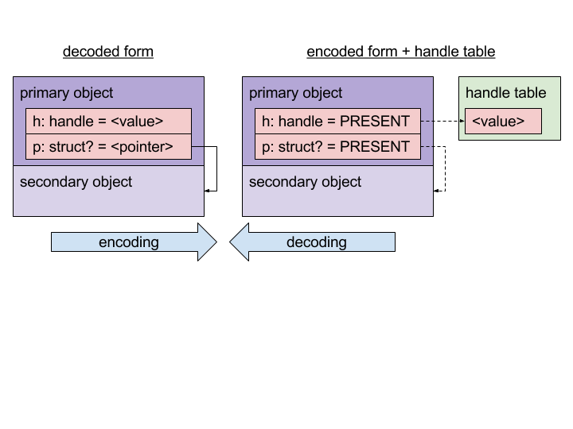
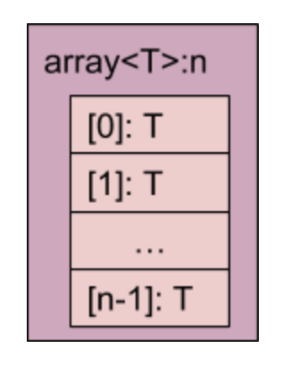
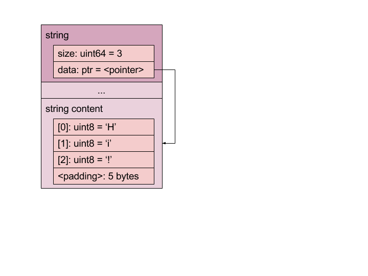
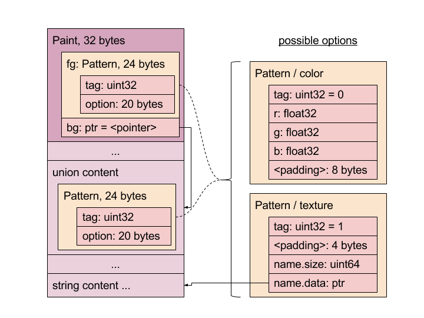
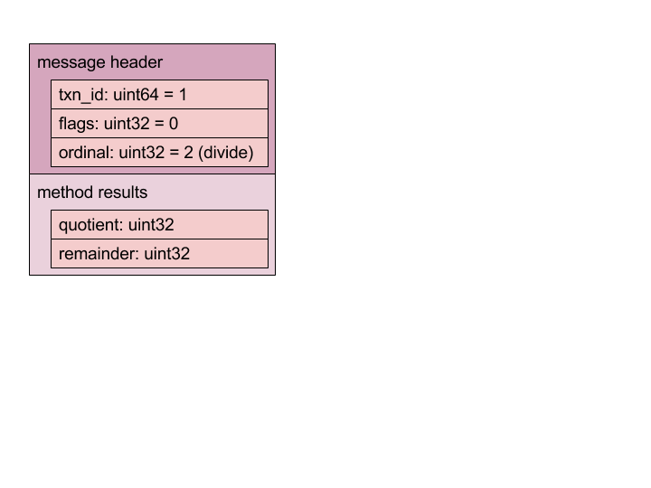
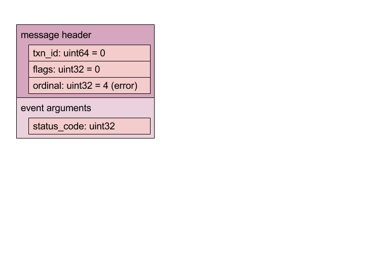

# Wire Format Specification

This document is a specification of the Fuchsia Interface Definition Language
(FIDL) data structure encoding.

See [Overview](../README.md) for more information about FIDL's overall
purpose, goals, and requirements, as well as links to related documents.

[TOC]

## Design

### Goals

*   Efficiently transfer messages between processes.
*   General purpose, for use with device drivers, high-level services, and
    applications.
*   Optimized for Zircon IPC only; portability is not a goal.
*   Optimized for direct memory access; inter-machine transport is not a goal.
*   Optimized for 64-bit only; no accommodation for 32-bit environments.
*   Uses uncompressed native data types with host-endianness and correct
    alignment to support in-place access of message contents.
*   Compatible with C structure in-memory layout (with suitable field ordering
    and packing annotations).
*   Structures are fixed size and inlined; variable-sized data is stored
    out-of-line.
*   Structures are not self-described; FIDL files describe their contents.
*   No versioning of structures, but interfaces can be extended with new methods
    for protocol evolution.
*   No offset calculations required, very little arithmetic which may overflow.
*   Support fast single-pass encoding and validation (as a combined operation).
*   Support fast single-pass decoding and validation (as a combined operation).

### Messages

A **message** is a contiguous data structure represented using the FIDL Wire
Format, consisting of a single **in-line primary object** followed by a sequence
of **out-of-line secondary objects** stored in **traversal order**.

#### Objects

Messages are aggregates of **objects**.

The **primary object** of a message is simply the first object it contains. It
is always a **struct** of fixed size whose type (and size) is known from the
context (such as by examining the **method ordinal** in the **interface call
header**).

To store variable-size or optional data, the primary object may refer to
**secondary objects**, such as string content, vector content, structs, and
unions. Secondary objects are stored **out-of-line** sequentially in traversal
order following the object which reference them. In encoded messages, the
presence of secondary objects is marked by a flag. In decoded messages, the
flags are substituted with pointers to their location in memory (or null
pointers when absent).

Primary and secondary objects are 8-byte aligned and stored sequentially in
traversal order without gaps other than the minimum required padding to maintain
object alignment.

Objects may also contain **in-line objects** which are aggregated within the
body of the containing object, such as embedded structs and fixed-size arrays of
structs. The alignment factor of in-line objects is determined by the alignment
factor of their most restrictive member.

In the following example, each Rect structure contains two Point objects which
are stored in-line whereas each Region structure contains a vector with a
variable number of Rect objects which are stored sequentially out-of-line. In
this case, the secondary object is the vector's content (as a unit).

```fidl
struct Region {
    vector<Rect> rects;
};
struct Rect {
    Point top_left;
    Point bottom_right;
};
struct Point { uint32 x, y; };
```


#### Traversal Order

The **traversal order** of a message is a determined by a recursive depth-first
walk of all of the **objects** it contains, as obtained by following the chain
of references.

Given the following structure:

```fidl
struct Cart {
    vector<Item> items;
};
struct Item {
    Product product;
    uint32 quantity;
};
struct Product {
    string sku;
    string name;
    string? description;
    uint32 price;
};
```

The depth-first traversal order for a Cart message is defined by the following
pseudo-code:

```
visit Cart:
    for each Item in Cart.items vector data:
        visit Item.product:
                visit Product.sku
                visit Product.name
                visit Product.description
                visit Product.price
            visit Item.quantity
```

#### Dual Forms

The same message content can be expressed in two forms -- **encoded** and
**decoded** -- which have the same size and overall layout but differ in terms
of their representation of pointers (memory addresses) or handles
(capabilities).

FIDL is designed such that **encoding** and **decoding** of messages can occur
in place in memory assuming that objects have been stored in traversal order.

The representation of encoded messages is unambiguous. There is exactly one
possible encoding for all messages of the same type with the same content.



#### Encoded Messages

An **encoded message** has been prepared for transfer to another process: it
does not contain pointers (memory addresses) or handles (capabilities).

During **encoding**…

*   all pointers to sub-objects within the message are replaced with flags which
    indicate whether their referent is present or not-present in traversal order
*   all handles within the message are extracted to an associated **handle
    vector** and replaced with flags which indicate whether their referent is
    present or not-present in traversal order

The resulting **encoding message** and **handle vector** can then be sent to
another process using **zx_channel_call()** or a similar IPC mechanism.

#### Decoded Messages

A **decoded message** has been prepared for use within a process's address
space: it may contain pointers (memory addresses) or handles (capabilities).

During **decoding**...

*   all pointers to sub-objects within the message are reconstructed using the
    encoded present / not-present flags in traversal order
*   all handles within the message are restored from the associated **handle
    vector** using the encoded present / not-present flags in traversal order

The resulting **decoded message** is ready to be consumed directly from memory.

## Data Types

### Primitives

*   Value stored in native machine format.
*   Packed with natural alignment.
    *   Each _m_-byte primitive is stored on an _m_-byte boundary.
*   Not nullable.

The following primitive types are supported:

Category                | Types
----------------------- | ----------------------------
Boolean                 | `bool`
Signed integer          | `int8 int16 int32 int64`
Unsigned integer        | `uint8 uint16 uint32 uint64`
IEEE 754 Floating-point | `float32 float64`

Number types are suffixed with their size in bits, `bool` is 1 byte.

### Enums

*   Primitive value representing a proper enumerated type; bit fields are not
    valid enums.
*   Stored directly using their underlying primitive type.
*   Not nullable.

From the perspective of the wire format, enums are just fancy names for
primitive types.

For example, an enum whose underlying type is
`int32` is stored in exactly the same way as any
ordinary C `int32_t` would be.

### Arrays

*   Fixed length sequence of homogeneous elements.
*   Packed with natural alignment of their elements.
    *   Alignment of array is the same as the alignment of its elements.
    *   Each subsequent element is aligned on element's alignment boundary.
*   The stride of the array is exactly equal to the size of the element (which
    includes the padding required to satisfy element alignment constraints).
*   Not nullable.
*   There is no special case for arrays of bools. Each bool element takes one
    byte as usual.

Arrays are denoted:

*   `array<T>:n`: where *T* can be any FIDL type
    (including an array) and *n* is the number of elements in the array.



### Strings

*   Variable-length sequence of UTF-8 encoded characters representing text.
*   Nullable; null strings and empty strings are distinct.
*   Can specify a maximum size, e.g. `string:40` for
    a maximum 40 byte string.
*   String content does not have a null-terminator.[^1]

*   Stored as a 16 byte record consisting of:

    *   `size` : 64-bit unsigned number of code
        units (bytes)
    *   `data` : 64-bit presence indication or
        pointer to out-of-line string data

*   When encoded for transfer, `data` indicates
    presence of content:

    *   `0` : string is null
    *   `UINTPTR_MAX` : string is non-null, data is
        the next out-of-line object

*   When decoded for consumption, `data` is a
    pointer to content.

    *   `0` : string is null
    *   `<valid pointer>` : string is non-null, data
        is at indicated memory address

Strings are denoted as follows:

*   `string` : non-nullable string (validation error
    occurs if null `data` is encountered)
*   `string?` : nullable string
*   `string:N, string:N?` : string with maximum
    length of <em>N</em> bytes



### Vectors

*   Variable-length sequence of homogeneous elements.
*   Nullable; null vectors and empty vectors are distinct.
*   Can specify a maximum size, e.g. `vector<T>:40`
    for a maximum 40 element vector.
*   Stored as a 16 byte record consisting of:
    *   `size` : 64-bit unsigned number of elements
    *   `data` : 64-bit presence indication or
        pointer to out-of-line element data
*   When encoded for transfer, `data` indicates
    presence of content:
    *   `0` : vector is null
    *   `UINTPTR_MAX` : vector is non-null, data is
        the next out-of-line object
*   When decoded for consumption, `data` is a
    pointer to content.
    *   `0` : vector is null
    *   `<valid pointer>` : vector is non-null, data
        is at indicated memory address
*   There is no special case for vectors of bools. Each bool element takes one
    byte as usual.

Vectors are denoted as follows:

*   `vector<T>` : non-nullable vector of element
    type <em>T</em> (validation error occurs if null
    `data` is encountered)
*   `vector<T>?` : nullable vector of element type
    <em>T</em>
*   `vector<T>:N, vector<T>:N?` : vector with
    maximum length of <em>N</em> elements

<em>T</em> can be any FIDL type.


### Handles

*   Transfers a Zircon capability by handle value.
*   Stored as a 32-bit unsigned integer.
*   Nullable by encoding as a zero-valued[^2] handle (equivalent to
    `ZX_HANDLE_INVALID`).

*   When encoded for transfer, the stored integer indicates presence of handle:

    *   `0` : handle is null
    *   `UINT32_MAX` : handle is non-null, handle
        value is the next entry in handle table

*   When decoded for consumption, the stored integer is handle value itself.

    *   `0` : handle is null
    *   `<valid handle>` : handle is non-null,
        handle value is provided in-line

Handles are denoted:

*   `handle` : non-nullable Zircon handle of
    unspecified type
*   `handle?` : nullable Zircon handle of
    unspecified type
*   `handle<H>` : non-nullable Zircon handle of type
    <em>H</em>
*   `handle<H>?` : nullable Zircon handle of type
    <em>H</em>
*   `Interface` : non-nullable FIDL interface
    (client endpoint of channel)
*   `Interface?` : nullable FIDL interface (client
    endpoint of channel)
*   `request<Interface>` : non-nullable FIDL interface
    request (server endpoint of channel)
*   `request<Interface>?` : nullable FIDL interface request
    (server endpoint of channel)

<em>H</em> can be one of[^3]: `channel, event, eventpair, fifo,
job, process, port, resource, socket, thread, vmo`

### Structs

*   Record type consisting of a sequence of typed fields.

*   Alignment factor of structure is defined by maximal alignment factor of any
    of its fields.

*   Structure is padded with zeroes so that its size is a multiple of its
    alignment factor.

    *   e.g. 1. a struct with an **int32** and an **int8** field has an
        alignment of 4 bytes (due to **int32**) and a size of 8 bytes (3 bytes
        of padding)
    *   e.g. 2. a struct with a **bool** and a **string** field has an alignment
        of 8 bytes (due to **string**) and a size of 24 bytes (7 bytes of
        padding)
    *   e.g. 3. a struct with a **bool** and a **uint8[2]** field has an
        alignment of 1 byte and a size of 3 bytes (no padding!)

*   In general, changing the definition of a struct will break binary
    compatibility; instead prefer to extend interfaces by adding new methods
    which use new structs.

Storage of a structure depends on whether it is nullable at point of reference.

*   Non-nullable structures:
    *   Contents are stored in-line within their containing type, enabling very
        efficient aggregate structures to be constructed.
    *   The structure layout does not change when inlined; its fields are not
        repacked to fill gaps in its container.
*   Nullable structures:
    *   Contents are stored out-of-line and accessed through an indirect
        reference.
    *   When encoded for transfer, stored reference indicates presence of
        structure:
        *   `0` : reference is null
        *   `UINTPTR_MAX` : reference is non-null,
            structure content is the next out-of-line object
    *   When decoded for consumption, stored reference is a pointer.
        *   `0` : reference is null
        *   `<valid pointer>` : reference is
            non-null, structure content is at indicated memory address

Structs are denoted by their declared name (e.g. <strong>Circle</strong>) and
nullability:

*   `Circle` : non-nullable Circle
*   `Circle?` : nullable Circle

The following example shows how structs are laid out according to their fields.

```fidl
struct Circle {
    bool filled;
    Point center;    // Point will be stored in-line
    float32 radius;
    Color? color;    // Color will be stored out-of-line
    bool dashed;
};
struct Point { float32 x, y; };
struct Color { float32 r, g, b; };
```

The Color content is padded to the 8 byte secondary object alignment
boundary.


### Unions

*   Tagged option type consisting of tag field and variadic contents.
*   Tag field is represented with a **uint32 enum**.
*   Size of union is the size of the tag field plus the size of the largest
    option including padding necessary to satisfy its alignment requirements.
*   Alignment factor of union is defined by the maximal alignment factor of the
    tag field and any of its options.
*   Union is padded so that its size is a multiple of its alignment factor.
    *   e.g. 1. a union with an **int32** and an **int8** option has an
        alignment of 4 bytes (due to **int32**) and a size of 8 bytes including
        the 4 byte tag (0 to 3 bytes of padding).
    *   e.g. 2. a union with a **bool** and a **string** option has an alignment
        of 8 bytes (due to **string**) and a size of 24 bytes (4 to 19 bytes of
        padding).
*   In general, changing the definition of a union will break binary
    compatibility; instead prefer to extend interfaces by adding new methods
    which use new unions.

Storage of a union depends on whether it is nullable at point of reference.

*   Non-nullable unions:
    *   Contents are stored in-line within their containing type, enabling very
        efficient aggregate structures to be constructed.
    *   The union layout does not change when inlined; its options are not
        repacked to fill gaps in its container.
*   Nullable unions:
    *   Contents are stored out-of-line and accessed through an indirect
        reference.
    *   When encoded for transfer, stored reference indicates presence of union:
        *   `0` : reference is null
        *   `UINTPTR_MAX` : reference is non-null,
            union content is the next out-of-line object
    *   When decoded for consumption, stored reference is a pointer.
        *   `0` : reference is null
        *   `<valid pointer>` : reference is
            non-null, union content is at indicated memory address

Union are denoted by their declared name (e.g. <strong>Pattern</strong>) and
nullability:

*   `Pattern` : non-nullable Shape
*   `Pattern?` : nullable Shape

The following example shows how unions are laid out according to their options.

```fidl
struct Paint {
    Pattern fg;
    Pattern? bg;
};
union Pattern {
    Color color;
    Texture texture;
};
struct Color { float32 r, g, b; };
struct Texture { string name; };
```

When laying out **Pattern**, space is first allotted to the tag (4 bytes) then
to the selected option.



### Transactional Messages

*   Transactions consist of sequences of correlated messages sent between the
    client and implementation of an interface over a Zircon channel.
*   Each message is prefixed with a simple 16 byte header, the body immediately
    follows header.
    *   `zx_txid_t txid`, transaction ID (32 bits)
        * txids with the high bit set are reserved for use by zx_channel_call
        * txids with the high bit unset are reserved for use by userspace
        * See the [channel call] manpage for more details on txid allocation
    *   `uint32 reserved0`, reserved for future use.
    *   `uint32 flags`, all unused bits must be set to zero
    *   `uint32 ordinal`
        *   The zero ordinal is invalid.
        *   Ordinals with the most significant bit set are reserved.
            *   Ordinals 0x80001xxx are "control" messages
            *   Ordinals 0x80002xxx are "fileio" messages
*   A non-zero transaction ID is used to correlate sequences of messages which
    involve a request and a response, e.g. in a two-way method call. The
    initiator of the request is responsible for assigning a unique transaction
    ID to the request. The handler of the request is responsible for echoing the
    transaction ID it received back into the response which it sends. The
    initiator can reuse transaction IDs once it receives their corresponding
    responses.
*   A zero transaction ID is reserved for messages which do not require a
    response from the other side, e.g. one-way calls or system messages.
*   There are three kinds of messages: method calls, method results, and control
    messages.
*   Ordinals indicate the purpose of the message.
    *   Ordinals with the most significant bit set are reserved for control
        messages and future expansion.
    *   Ordinals without the most significant bit set indicate method calls and
        responses.
*   Flags control the interpretation of the message. All unused bits must be set
    to zero.
    *   Currently there are no flags, so all bits must be zero.

Messages which are sent directly through Zircon channels have a maximum total
size (header + body) which is defined by the kernel <em>(currently 64 KB,
eventual intent may be 16 KB).</em>

It is possible to extend interfaces by declaring additional methods with unique
ordinals. The language also supports creating derived interfaces provided the
method ordinals remain unique down the hierarchy. Interface derivation is purely
syntactic; it does not affect the wire format).

We'll use the following interface for the next few examples.

```fidl
    interface Calculator {
        1: Add(int32 a, int32 b) -> (int32 sum);
        2: Divide(int32 dividend, int32 divisor)
        -> (int32 quotient, int32 remainder);
        3: Clear();
    };
```

_FIDL does not provide a mechanism to determine the "version" of an interface;
interface capabilities must be determined out-of-band such as by querying a
**ServiceProvider** for an interface "version" by name or by other means._

#### Method Call Messages

The client of an interface sends method call messages to the implementor of the
interface to invoke methods of that interface.

If a server receives an unknown, unsupported, or unexpected method call message,
it must close the channel.

The message indicates the method to invoke by means of its ordinal index. The
body of the message contains the method arguments as if they were packed in a
**struct**.


#### Method Result Messages

The implementor of an interface sends method result messages to the client of
the interface to indicate completion of a method invocation and to provide a
(possibly empty) result.

If a client receives an unknown, unsupported, or unexpected method call message,
it must close the channel.

Only two-way method calls which are defined to provide a (possibly empty) result
in the FIDL interface declaration will elicit a method result message. One-way
method calls must not produce a method result message.

A method result message provides the result associated with a prior method call.
The body of the message contains the method results as if they were packed in a
**struct**.

The message result header consists of `uint32 txid, uint32 reserved, uint32
flags, uint32 ordinal`.  The `txid` must be equal to the `txid` of the method
call to which this message is a response. The flags must be zero. The `ordinal`
must be equal to the `ordinal` of the method call to which this message is a
response.



#### Event Messages

These support sending unsolicited messages from the server back to the client.

```fidl
interface Calculator {
    1: Add(int32 a, int32 b) -> (int32 sum);
    2: Divide(int32 dividend, int32 divisor) -> (int32 quotient, int32 remainder);
    3: Clear();
    4: -> Error(uint32 status_code);
};
```

The implementor of an interface sends unsolicited event messages to the client
of the interface to indicate that an asynchronous event occurred as specified by
the interface declaration.

Events may be used to let the client observe significant state changes without
having to create an additional channel to receive the response.

In the **Calculator** example, we can imagine that an attempt to divide by zero
would cause the **Error()** event to be sent with a "divide by zero" status code
prior to the connection being closed. This allows the client to distinguish
between the connection being closed due to an error as opposed to for other
reasons (such as the calculator process terminating abnormally).

The body of the message contains the event arguments as if they were packed in a
**struct**, just as with method result messages.



#### Control Messages

Control messages support in-band signaling of events other than method calls and
responses.

If a client or server receives an unknown, unsupported, or unexpected control
message, it must _discard it_. This allows for future expansion of control
messages in the protocol.

The maximum size of a valid control message is **512 bytes**, including the
header.

##### Epitaph (Control Message Ordinal 0xFFFFFFFF)

An epitaph is a message with ordinal **0xFFFFFFFF**.  A server may send an
epitaph as the last message prior to closing the connection, to provide an
indication of why the connection is being closed.  No further messages may be
sent through the channel after the epitaph.  Epitaphs are not sent from clients
to servers.

The epitaph contains an error status.  The error status of the epitaph is stored
in the reserved uint32 of the message header.  The reserved word is treated as
being of type **zx_status_t**: negative numbers are reserved for system error
codes, positive numbers are reserved for application error codes, and ZX_OK is
used to indicate normal connection closure.  The message is otherwise empty.

## Details

#### Size and Alignment

`sizeof(T)` denotes the size in bytes for an object
of type T.

`alignof(T)` denotes the alignment factor in bytes
to store an object of type T.

FIDL primitive types are stored at offsets in the message which are a multiple
of their size in bytes. Thus for primitives T_,_ `alignof(T) ==
sizeof(T)`. This is called <em>natural alignment</em>. It has the
nice property of satisfying typical alignment requirements of modern CPU
architectures.

FIDL complex types, such as structs and arrays, are stored at offsets in the
message which are a multiple of the maximum alignment factor of any of their
fields. Thus for complex types T, `alignof(T) ==
max(alignof(F:T))` over all fields F in T. It has the nice
property of satisfying typical C structure packing requirements (which can be
enforced using packing attributes in the generated code). The size of a complex
type is the total number of bytes needed to store its members properly aligned
plus padding up to the type's alignment factor.

FIDL primary and secondary objects are aligned at 8-byte offsets within the
message, regardless of their contents. The primary object of a FIDL message
starts at offset 0. Secondary objects, which are the only possible referent of
pointers within the message, always start at offsets which are a multiple of 8.
(So all pointers within the message point at offsets which are a multiple of 8.)

FIDL in-line objects (complex types embedded within primary or secondary
objects) are aligned according to their type. They are not forced to 8 byte
alignment.

<table>
  <tr>
   <td><strong>types</strong>
   </td>
   <td><strong>sizeof(T)</strong>
   </td>
   <td><strong>alignof(T)</strong>
   </td>
  </tr>
  <tr>
   <td>bool
   </td>
   <td>1
   </td>
   <td>1
   </td>
  </tr>
  <tr>
   <td>int8, uint8
   </td>
   <td>1
   </td>
   <td>1
   </td>
  </tr>
  <tr>
   <td>int16, uint16
   </td>
   <td>2
   </td>
   <td>2
   </td>
  </tr>
  <tr>
   <td>int32, uint32
   </td>
   <td>4
   </td>
   <td>4
   </td>
  </tr>
  <tr>
   <td>float32
   </td>
   <td>4
   </td>
   <td>4
   </td>
  </tr>
  <tr>
   <td>int64, uint64
   </td>
   <td>8
   </td>
   <td>8
   </td>
  </tr>
  <tr>
   <td>float64
   </td>
   <td>8
   </td>
   <td>8
   </td>
  </tr>
  <tr>
   <td>enum
   </td>
   <td>sizeof(underlying type)
   </td>
   <td>alignof(underlying type)
   </td>
  </tr>
  <tr>
   <td>array<T>:n
   </td>
   <td>sizeof(T) * n
   </td>
   <td>alignof(T)
   </td>
  </tr>
  <tr>
   <td>string, string?, string:N, string:N?
   </td>
   <td>16
   </td>
   <td>8
   </td>
  </tr>
  <tr>
   <td>vector<T>, vector<T>?,
<p>
vector<T>:N,
<p>
vector<T>:N?
   </td>
   <td>16
   </td>
   <td>8
   </td>
  </tr>
  <tr>
   <td>handle, handle?, handle<H>, handle<H>?,
<p>
Interface, Interface?, request<Interface>, request<Interface>?
   </td>
   <td>4
   </td>
   <td>4
   </td>
  </tr>
  <tr>
   <td>struct T
   </td>
   <td>sum of field sizes and padding for alignment
   </td>
   <td>maximum alignment factor among all fields
   </td>
  </tr>
  <tr>
   <td>struct T?
   </td>
   <td>8
   </td>
   <td>8
   </td>
  </tr>
  <tr>
   <td>union T
   </td>
   <td>maximum of field sizes and padding for alignment
   </td>
   <td>maximum alignment factor among all fields
   </td>
  </tr>
  <tr>
   <td>union T?
   </td>
   <td>8
   </td>
   <td>8
   </td>
  </tr>
  <tr>
   <td>message header
   </td>
   <td>16
   </td>
   <td>16
   </td>
  </tr>
</table>

#### Padding

The creator of a message must fill all alignment padding gaps with zeros.

The consumer of a message may verify that padding contains zeroes (and generate
an error if not) but it is not required to check as long as it does not actually
read the padding bytes.

#### Maximum Recursion Depth

FIDL arrays, vectors, structures, and unions enable the construction of
recursive messages. Left unchecked, processing excessively deep messages could
lead to resource exhaustion of the consumer.

For safety, the maximum recursion depth for all FIDL messages is limited to
**32** levels of nested complex objects. The FIDL validator **must** enforce
this by keeping track of the current nesting level during message validation.

Complex objects are arrays, vectors, structures, or unions which contain
pointers or handles which require fix-up. These are precisely the kinds of
objects for which **encoding tables** must be generated. See [C
Language Bindings](../../languages/c.md)
for information about encoding
tables. Therefore limiting the nesting depth of complex objects has the effect
of limiting the recursion depth for traversal of encoding tables.

Formal definition:

*   The message body is defined to be at nesting level **0**.
*   Each time the validator encounters a complex object, it increments the
    nesting level, recursively validates the object, then decrements the nesting
    level.
*   If at any time the nesting level exceeds **31**, a validation error is
    raised and validation terminates.

#### Validation

The purpose of message validation is to discover wire format errors early before
they have a chance to induce security or stability problems.

Message validation is **required** when decoding messages received from a peer
to prevent bad data from propagating beyond the service entry point.

Message validation is **optional but recommended** when encoding messages to
send to a peer to help localize violated integrity constraints.

To minimize runtime overhead, validation should generally be performed as part
of a single pass message encoding or decoding process such that only a single
traversal is needed. Since messages are encoded in depth-first traversal order,
traversal exhibits good memory locality and should therefore be quite efficient.

For simple messages, validation may be very trivial, amounting to no more than a
few size checks. While programmers are encouraged to rely on their FIDL bindings
library to validate messages on their behalf, validation can also be done
manually if needed.

Conformant FIDL bindings must check all of the following integrity constraints:

*   The total size of the message including all of its out-of-line sub-objects
    exactly equals the total size of the buffer that contains it. All
    sub-objects are accounted for.
*   The total number of handles referenced by the message exactly equals the
    total size of the handle table. All handles are accounted for.
*   The maximum recursion depth for complex objects is not exceeded.
*   All enum values fall within their defined range.
*   All union tag values fall within their defined range.
*   Encoding only:
    *   All pointers to sub-objects encountered during traversal refer precisely
        to the next buffer position where a sub-object is expected to appear. As
        a corollary, pointers never refer to locations outside of the buffer.
*   Decoding only:
    *   All present / not-present flags for referenced sub-objects hold the
        value **0** or **UINTPTR_MAX**.
    *   All present / not-present flags for referenced handles hold the value
        **0** or **UINT32_MAX.**

Stricter FIDL bindings may perform some or all of the following additional
safety checks:

*   All padding is filled with zeroes.
*   All floating point values represent valid IEEE 754 bit patterns.
*   All bools have the value **0** or **1**.

<!-- Footnotes themselves at the bottom. -->

## Notes

[channel call]: ../../syscalls/channel_call.md

[^1]: Justification for unterminated strings. Since strings can contain embedded
    null characters, it is safer to encode the size explicitly and to make no
    guarantees about null-termination, thereby defeating incorrect assumptions
    that clients might make. Modern APIs generally use sized strings as a
    security precaution. It's important that data always have one unambiguous
    interpretation.
[^2]: Defining the zero handle to mean "there is no handle" makes it is safe to
    default-initialize wire format structures to all zeroes. Zero is also the
    value of the `ZX_HANDLE_INVALID` constant.
[^3]: New handle types can easily be added to the language without affecting the
    wire format since all handles are transferred the same way.
