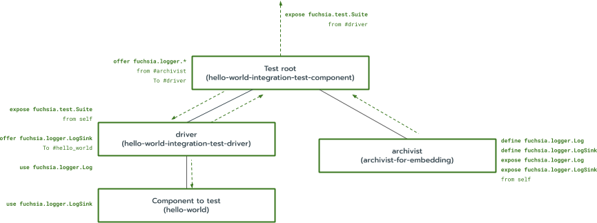

# Test Components (Components v2)

<<../components/_v2_banner.md>>

## Integration Tests

This section defines various patterns commonly used to author integration tests.
Note that test authors can use other patterns if it makes sense for their
project.

### Driver pattern for v2 component tests

This section demonstrates how to use the driver pattern to write your test.
See this `BUILD.gn` file as an example:

```gn

```

The topology for the example will look like:

<br><br>

In this example the test package `hello-world-integration-test` contains four
components:

- **hello-world-integration-test-component** - Main entry point
- **hello-world** - Component to test
- **hello-world-integration-test-driver** - Test driver
- **archivist-for-embedding** - Helper component which provides services to
other components.

`hello-world-integration-test-component` has two children:

- **hello-world-integration-test-driver**
- **archivist-for-embedding**

This is a simple component realm which launches
`hello-world-integration-test-driver` and offers it helper services.

Please note how it exposes `fuchsia.test.Suite` from test driver. Entry point
of a test root needs to expose that protocol.

```json5

```

`hello-world-integration-test-driver` contains the test logic and expectations.
The component launches the `hello-world` component and asserts that it is
writing the expected strings to the log. Note that it exposes protocol
`fuchsia.test.Suite` and uses `rust_runner` in its manifest file. This is how
the test component integrates with the Test Runner Framework.

```json5

```

The code for this example can be found under
[`//examples/components/basic/integration_tests`][driver-pattern-example].

## Running the tests

To run a Fuchsia test use this command:

<pre class="prettyprint">
<code class="devsite-terminal">fx test <var>TEST_NAME</var></code>
</pre>

For more information, see [Run Fuchsia tests][executing-tests].

## Running test cases in parallel

Different test runtimes support different levels of parallelism. Their default
behaviors might differ. For instance, GoogleTest C++ tests default to running
serially (one at a time), while Rust tests run multiple tests concurrently.

You can specify the maximum parallelism for tests in the build definition to
override the default behavior, as shown below.

  * {Using fuchsia_test_package}

  ```gn
  fuchsia_component("my-package") {
    testonly = true
    manifest = "meta/my-test.cml"
    deps = [ ":my_test" ]
  }

  fuchsia_test_package("my-package") {
    test_specs = {
        parallel = 1
    }
    test_components = [ ":my-test" ]
  }
  ```

  * {Using test_package}

  ```gn
  test_package("my-package") {
    deps = [
      ":my_test",
    ]

    meta = []
      {
        path = rebase_path("meta/my-test.cml")
        dest = "my-test.cm"
      },
    ]

    tests = [
      {
        parallel = 1
        name = "my_test"
        environments = basic_envs
      },
    ]
  }
  ```

When running the test on a development device, prefer `fx test` to run the test.
The tool automatically picks the configuration and passes it to
run-test-suite. If for some reason you need to use `run-test-suite`, you need
to pass the flag.

```sh
fx shell run-test-suite --parallel=5 <test_url>
```

[driver-pattern-example]: /examples/components/basic/integration_tests/
[executing-tests]: /docs/development/testing/run_fuchsia_tests.md
