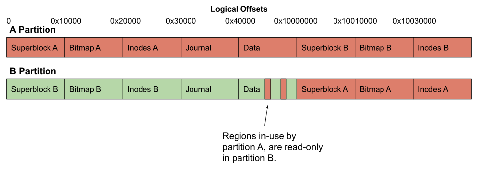
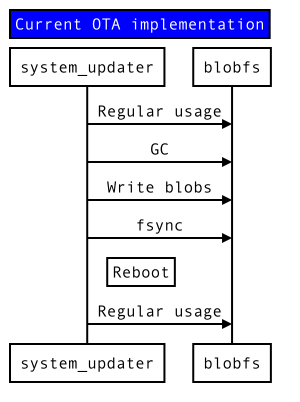
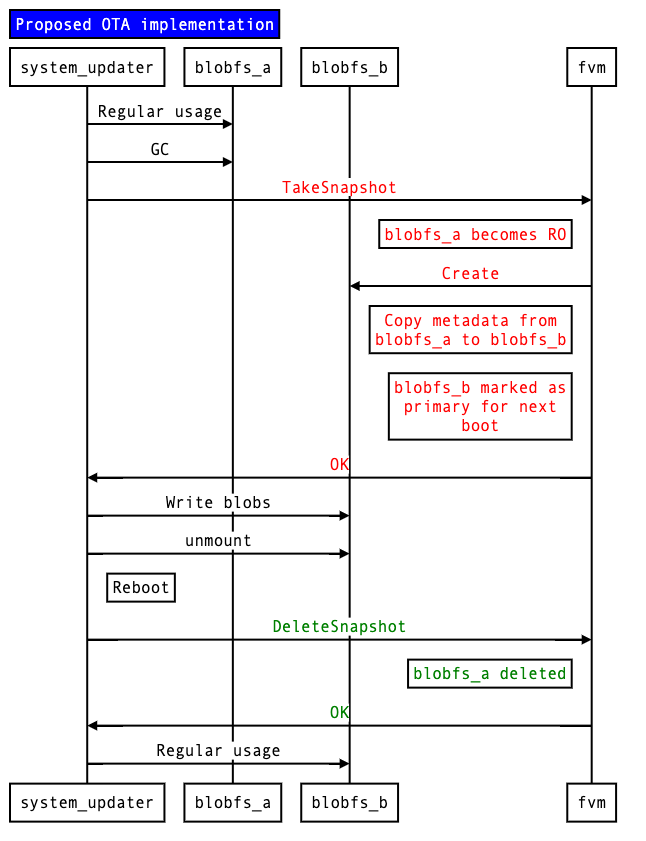
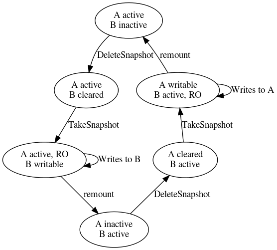



# {{ rfc.name }} - {{ rfc.title }}
<!-- *** DO NOT EDIT ABOVE THIS LINE -->

## Summary

Note: This RFC has been withdrawn. It was originally Accepted on 2020-09-21. See [Rationale for
withdrawal](#rationale-for-withdrawal). This RFC is otherwise retained in its original state for
historical purposes.

This RFC describes a simple snapshot mechanism that gives increased resilience
to bugs in the upgrade process. Changes to the Fuchsia Volume Manager (FVM),
allow a snapshot of the Blobfs partition to be taken that can be reverted to at
any stage during the upgrade.

## Motivation

At time of writing, a failed upgrade that causes corruption of a Blobfs
partition can leave devices in states that are hard to recover from. The
recovery partition currently lacks the ability to restore devices in this state,
so the only supported way of restoring in these cases is via bootloaders using a
process that is not friendly to end-users.

A snapshot mechanism would reduce the risk of us ending up in this state.

## Design

The basic concept is to support a primitive snapshot mechanism within FVM, that
allows for the appearance of two partitions for the duration of an upgrade, but
allows for sharing data between the partitions.

At this time, FVM is a simple volume-manager, it has the ability to map slices
from arbitrary slice-aligned logical offsets, to specific offsets on the
underlying device, and it keeps mappings from different partitions separate.

Blobfs consists of the following distinct regions:

Region            |
----------------- |
Superblock        |
Allocation bitmap |
Inodes            |
Journal           |
Data              |

To support the proposal here, we could allow different _slice types_ within
FVM &nbsp;{#back-1}[\[1\]](#footnote-1). The types would apply to _extents_ of slices:

Type                       | Description                                                                                                                                           |
-------------------------- | ----------------------------------------------------------------------------------------------------------------------------------------------------- |
A/B slices  | This would be an extent of slices that have an alternate copy.                                                                                                       |
A/B bitmap &nbsp;{#back-2}[\[2\]](#footnote-2) | This would be an extent of slices that have an alternate copy of a bitmap that represents allocations in a shared data extent. |
Shared data | This would be an extent of slices whose allocation is managed by an A/B bitmap extent.                                                                               |
Shared      | This would be an extent that is shared between the two partitions, but only one of the partitions could write to the region at a time.                               |

With these slice types, it would then be possible for FVM to present _two_
partitions showing the A/B variations of the extents. So, going back to the
Blobfs regions, we would have:

Region            | Type
----------------- | -----------
Superblock        | A/B slices
Allocation bitmap | A/B bitmap
Inodes            | A/B slices
Journal           | Shared &nbsp;{#back-3}[\[3\]](#footnote-3)
Data              | Shared data

Most of the time, only one of the partitions would be active, and the system
would appear just as it is today.

During upgrade, the second partition can be activated at which point the first
partition becomes _locked_ and no further writes are allowed to it, but reads
would continue to be served. The second partition can be prepared, potentially
in just the same way as it is now, but throughout the upgrade period there is
always the option to go back to the first partition, which is guaranteed to
remain untouched.

For the A/B extents, it’s easy to see how the first partition’s data is
preserved; the second partition wouldn’t see the first partition’s data. For the
journal, the shared region — only the writable partition would be able to write
to it; i.e. the second partition. For the shared data region, the bitmap would
indicate which of the blocks could be written to. Any blocks marked as used by
the first partition would appear to be read-only to both partitions.

To facilitate this scheme the second partition would also need to be able to
read the alternate bitmap, so that it could know which blocks it is allowed to
allocate, so to allow for this, it could be presented in the logical address
space at some currently unused offset. A strawman proposal is that all of the
alternate A/B extents would appear at the same offset but with the top bit set
(read-only).

The following diagram hopefully illustrates how each of the partitions would
appear:



**Figure 1: Partition arrangement.**

Notes:

*   It gets us some of the resilience that we would have got from the simple A/B
    partition approach, but _not all._
*   We can keep the current incremental approach to updates (i.e. only update
    blobs that have changed) at the expense of not ending up with a predictable
    layout. On user builds, we would have the option of completely rewriting all
    the blobs, but we would still be at the mercy of fragmentation.
*   It adds complexity into FVM.

### New Upgrade flow

The upgrade flow must be modified to facilitate the snapshotting interactions.
The current flow is shown in [Figure 2](#fig-2), and the proposed alternative in
[Figure 3](#fig-3). New APIs and interactions are colored.

{#fig-2}


**Figure 2: Current upgrade implementation (high-level)**

{#fig-3}


**Figure 3: Proposed upgrade implementation (high-level)**

### New FVM operations

Several new FVM operations must be implemented and integrated into the Software
Delivery (SWD) stack. These APIs are used to drive a state machine ([Figure
4](#fig-4)), which ultimately switches the system between partitions.

{#fig-4}


**Figure 4: State machine for snapshotting.**

#### TakeSnapshot

**Snapshots the active partition's metadata into the alternate partition, which
was previously cleared (see "DeleteSnapshot"). The active partition becomes
read-only, and all subsequent writes must now go to the inactive partition.**

*   FVM makes the active partition read-only.
    *   Pending journal entries must be flushed.
*   FVM creates the inactive partition.
*   FVM copies over the metadata from the active->inactive partition.

Writing new blobs for the duration of this multi-step process would not be
possible, and half written blobs would have to be abandoned, which should not be
limiting given the component responsible for writing the blobs should be the
same component responsible for asking for the snapshot.

#### CancelSnapshot

**Cancels the population of a snapshot created by TakeSnapshot, clearing the
inactive partition and allowing another snapshot to be created.**

*   At this time, all read connections to the inactive partition must be closed.
*   The inactive partition will be deleted by FVM. The active partition will
    become writable again.

#### SetWritablePartition

**Switches which partition is writable.**

*   The journal must be flushed at this point (all pending operations must
    complete). The fsync call in the diagram above can facilitate this, but
    ideally the journal flushing is done transactionally with the rest of this
    operation so no new writes can "sneak in".

This will likely be rarely used since TakeSnapshot will automatically switch the
writable partition, but if there is a need to return and make the active
partition writable (in order to garbage collect unused blobs, for example), then
this API can be used.

#### SetBootPartition

**Changes which partition is bootable.**

Normally, the bootable partition will change depending on which ZBI slot is
active, but it will also be possible to separately switch which partition is
bootable. This will likely be rarely used.

#### DeleteSnapshot

**Marks the alternate partition as cleared. FVM may choose to delete the
metadata therein.**

#### ListSnapshotPartitions

**Queries FVM for partitions that are configured for snapshotting.**

#### QuerySnapshotPartition

**Queries FVM for information about the of partitions that supports
snapshotting.**

*   Identifies the state of the A/B partitions, such as which is active.

### Failure Modes

The system may encounter a failure from any of the states described in the state
machine. This section describes the appropriate actions to take if the system
encounters a failure.

Note that failures may be voluntary (where the system actively decides to cancel
an ongoing update) or involuntary (where the system fails due to external
factors, such as losing power). Both cases must be considered.

Note that blobfs has a journalling mechanism that protects against metadata
corruption in cases of involuntary failure during modification. No additional
work is required to make blobfs robust to involuntary failures during
modification.

Any of the new metadata operations in FVM should be made transactional where
necessary, to prevent FVM from becoming corrupted by an involuntary failure
during modification.

#### State 1: Before TakeSnapshot

There are no changes necessary for failure handling in this state; behaviour is
identical to the current system behaviour.

#### State 2: After TakeSnapshot, Before reboot

*   For voluntary failures, the CancelSnapshot API can be invoked to delete the
    inactive partition and return the system back into State 1.
*   For involuntary failures, the system can either decide to simply abort the
    update once it comes back online (by invoking CancelSnapshot), or the system
    may choose to attempt to resume the update.

#### State 3: After reboot, before TakeSnapshot

Equivalent to State 1.

### Supporting ephemeral packages

Ephemeral packages are those that are not included in the base set of packages
for a given system version.

This proposal imposes few additional restrictions on ephemeral packages; the
below section [Routing of newly created files](#routing-of-newly-created-files)
describes how ephemeral packages can continue to be supported at any state
during the OTA, with one caveat where ephemeral packages must be deleted if the
snapshot is aborted while the new base partition was being prepared.

Ephemeral packages may persist across updates, since those written before the
update begins into the active partition will be copied into the inactive
partition when TakeSnapshot is called, and after that point, all ephemeral
packages are written into the new partition, which is readable and writable to
the system (and will become the new active partition after the update
completes).

### Routing of newly created files

There are three cases to consider when deciding where a new file is
installed. To simplify the discussion, assume that partition A is active and
partition B is inactive.

#### Case 1: Before TakeSnapshot

*   Base packages: Not written.
*   Ephemeral packages: Written to partition A.

#### Case 2: After TakeSnapshot, before reboot

*   Base packages: Written to partition B.
*   Ephemeral packages: Written to partition B. Note that these packages will be
    deleted if the snapshot is aborted, before the next snapshot is attempted.

#### Case 3: After remount (NB: equivalent to "Before TakeSnapshot")

*   Base packages: Not written.
*   Ephemeral packages: Written to partition B.

### Changes to FVM Metadata

FVM’s metadata has the following structure:

Region           | Description                                                                                                                                                   |
---------------- | ------------------------------------------------------------------------------------------------------------------------------------------------------------- |
Superblock       | What you’d expect.                                                                                                                                            |
Partition table  | An array of entries, one for each partition, containing things like name of partition, type, etc.                                                             |
Slice allocation | An array of entries, one for each allocatable slice that indicates which partition it is allocated to (if any) and the logical offset within that partition. |

To facilitate the proposal, additional metadata is required to record slice
types for extents, so something like the following needs to be stored somewhere:

```
enum class uint32_t SliceType {
  kNormal,
  kAB,
  kABBitmap,
  kSharedData,
  kShared,
};

struct {
  uint32_t slice_offset;  // Offset within the partition
  SliceType slice_type;   // The slice type
} extents[8];
```

This metadata could be added to each partition entry. A better approach might be
to add a separate partition containing this metadata (i.e. a snapshot metadata
partition). The precise location and structure of this metadata is not discussed
here and left as an implementation detail.

With this structure, the extents for Blobfs would be:

```
[
  /* super block: */       { 0,                    SliceType::kAB },
  /* allocation bitmap: */ { 0x10000 / kSliceSize, SliceType::kABBitmap },
  /* inodes: */            { 0x20000 / kSliceSize, SliceType::kAB },
  /* journal: */           { 0x30000 / kSliceSize, SliceType::kShared },
  /* data: */              { 0x40000 / kSliceSize, SliceType::kSharedData }
]
```

Some state is required, to indicates which of the two partitions is currently
writable, whether both partitions are active (or just one) and which partition
should be considered bootable &nbsp;{#back-4}[\[4\]](#footnote-4).

No changes would be required to slice allocation, except that slices at
alternate offsets would need to be allocated.

There might be other minor changes required for the super block (e.g. a bump in
the version).

### Supporting blobfs format evolution

This proposal substantially simplifies blobfs format evolution since the
alternative partition can be completely deleted and re-created with little cost
on each update.

That said, there are still two challenges to deal with when evolving the blobfs
format under this proposal.

*   The block allocation map cannot change, because it is a structure shared
    between both active/inactive partitions. (Given how simple the allocation
    map is, this seems perfectly acceptable.)
*   The active partition cannot overwrite any extents that are also allocated
    by the inactive partition. However, this is fairly simple to deal with: if
    the internal format of some data in an extent needs to change, the system
    can simply allocate new extents and move the data over, during the
    TakeSnapshot call.

## Implementation

The implementation will require the following changes, which are roughly
dependent on the changes that preceed them:

1.  Changes to FVM, and partition set up.
1.  Changes to Blobfs allocation.
1.  Changes to early bootstrap code.
1.  Changes to the upgrade process to use the new APIs.

The majority of changes are required by #1 and #4. #1 will involve an on-disk
format change and migrating will be supported with a clean install. Reverting
will also require a clean install. This is the critical step that involves most
risk, but note that only the format change needs to be in place; any code that
uses the new FVM metadata can remain dormant until later phases.

The other steps can all be landed without requiring a clean install and can be
reverted likewise.

## Performance

This should have a negligible impact on performance. During upgrades there might
be a small impact due to costs involved in snapshotting, but this is likely
insignificant relative to other upgrade activities. At other times, there should
be no change.

## Space requirements

Space needs to be reserved for extra copies of Blobfs regions: the Superblock,
Inode table and Bitmap. How much this is exactly depends on the configuration
for the device, but it should be relatively small compared with the total amount
of space available to Blobfs.

## Security considerations

None.

## Privacy considerations

None.

## Testing

Standard Fuchsia test practices will be used. Existing system tests should
already be testing upgrades. These will be expanded to include tests that
deliberately corrupt the new Blobfs partition and tests that try to deliberately
corrupt the snapshot partition.

## Documentation

The new architecture and features of FVM will be described under
[Fuchsia > Concepts > Filesystem Architecture](/docs/concepts/filesystems/filesystems.md).

## Drawbacks, alternatives, and unknowns

### Full A/B proposal

A full A/B proposal was considered. While that proposal is conceptually simple,
it has some significant downsides:

*   Each partition can only use 50% of the available disk space.
    *   This is currently a _soft_ constraint on our system updates, which are
        budgeted to only use 50% of the available Blobfs space, but the A/B
        proposal would make this a hard constraint.
    *   Engineering builds already exceed the 50% budget, so they do not
        support upgrades that modify many files. Engineers rely heavily on the
        ability to do incremental, small updates; breaking this workflow is a
        non-starter.
*   There is no mechanism to share files between the partitions, thus making
    every update rewrite every file.
    *   This implies additional flash wear, and slower upgrades. Every update
        would essentially be a maximal update.

### Full FVM Snapshot Feature

There are challenges with developing a full FVM snapshot feature. Traditional
snapshot mechanisms are typically dynamic in nature, which means that metadata
needs to be updated as writes arrive. Furthermore, there is a mismatch between
FVM’s slice size (currently 1 MiB, soon to be 32 KiB) and Blobfs’s block size (8
KiB). Addressing this would involve a substantial increase in complexity to FVM
and there are also edge cases where it’s possible to run out of space. Maybe a
scheme could be developed that had static mappings, but before too long, you
would end up with a proposal not too dissimilar from the one presented here.
Altogether, this would likely take much longer to implement, would potentially
have some serious downsides (write amplification, complexity), and offers no
clear benefits that we see needing in the near future. It is possible that a
full snapshot feature would help in the longer term, so the precise design of
FVM's metadata should provide room for expansion to support such use cases in
future.

## Prior art and references

Reliable and resilient upgrades is a common problem typically solved in the
following ways:

1.  A/B copies: keep functionally equivalent copies and switch between them as
    required. Simple, but costs space.
1.  A/R copies: keep a recovery copy, which is a stripped down version that only
    supports restoring software. More complicated, lower space requirements,
    slightly degraded user experience.
1.  A/B/R: a combination of #1 & #2.
1.  A + snapshot: most of the time, have only one copy available. At upgrade
    time, take a snapshot of A and apply the update as deltas on the snapshot.
    At any time, provide the option to roll back to the snapshot. Often
    complicated, but flexible.

The authors believe Android uses #3, iOS and macOS use #2 & #4.

This RFC is a simplified version of #4.

## Rationale for withdrawal {#rationale-for-withdrawal}

Development on this RFC proceeded for several months before we decided to discontinue work on
this RFC. There were several factors in this decision, the main being:

* Technical debt in the FVM codebase led to slow progress and risky changes. Lack
  of test coverage, long-latent bugs, and widespread assumptions about the format layout of FVM
  (due to lack of encapsulation for the FVM format) were the main hindrances.

* FVM was under-documented and poorly understood by the team. Organizational knowledge about FVM
  had decayed over time, and the initial assumption that FVM would be a relatively simple and
  appropriate place to build this feature was incorrect.

* The impact of rolling out the feature was higher than originally understood, since the
  feature would require an FVM major format revision which was determined to be highly
  disruptive to engineering efforts (since it requires reimaging devices, and since it
  also requires rolling the Zedboot version, which itself is a highly disruptive operation).

Given the high risk of developing this feature, and the high likelihood of impact on the growing
Fuchsia developer community, it no longer made sense to pursue this feature. Instead, the storage
team will be focusing efforts on improving test coverage and automation to mitigate the risks
described in the motivation for this RFC, proceeding with a rewrite of the FVM host tooling (a
substantial source of unexpected complexity), and evaluating the possibility of reducing reliance
on particular FVM/Zedboot versions to reduce impact to developers when either of these need to be
changed.

---

{#footnote-1}[1]: Note that these additional slice types do not necessarily need
    to be added to the FVM format; there are a number of ways of expressing this
    metadata and the precise format is left as an implementation
    detail. [&#x21A9;&#xFE0E;︎](#back-1)

{#footnote-2}[2]: We could, as a possible simplification, leave out the A/B
    bitmap and shared data types and trust that Blobfs behaves
    correctly. However, including this within FVM gives us an extra level of
    protection against bugs in the Blobfs implementation. There is also the
    option of leaving room and adding this at a later
    stage. [&#x21A9;&#xFE0E;︎](#back-2)

{#footnote-3}[3]: The journal’s region can be shared. At the time at which the
    second partition is activated, the journal can be flushed at which time it
    is no longer needed for the locked, read-only partition; it is only needed
    to prevent inconsistencies on the writable
    partition. [&#x21A9;&#xFE0E;︎](#back-3)

{#footnote-4}[4]: It is possible this bootable state could be stored elsewhere
    and passed to FVM at bind time, but it’s likely easier to just store this
    state within FVM. [&#x21A9;&#xFE0E;︎](#back-4)
