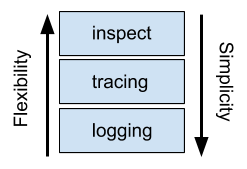
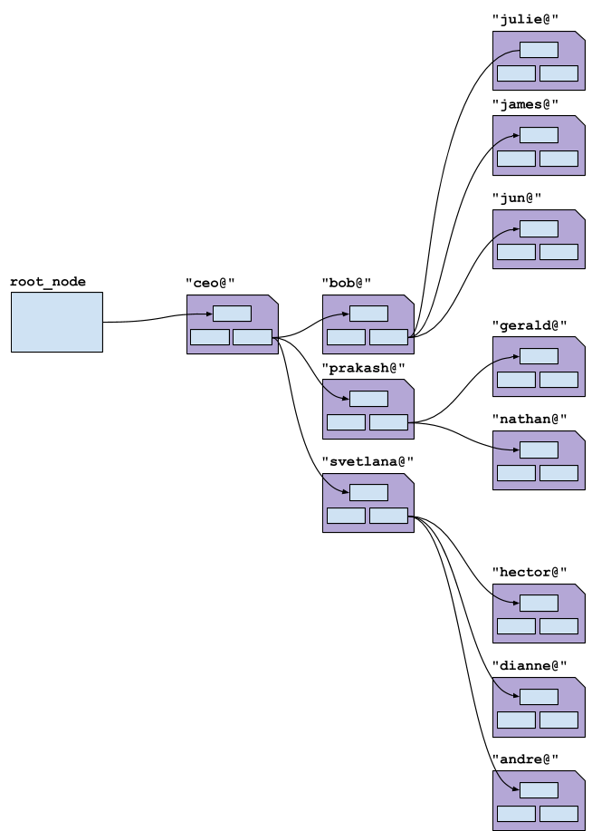
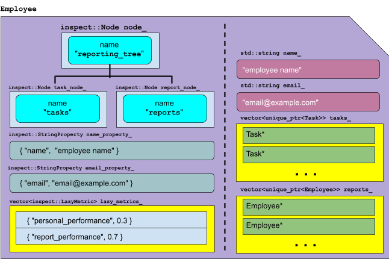
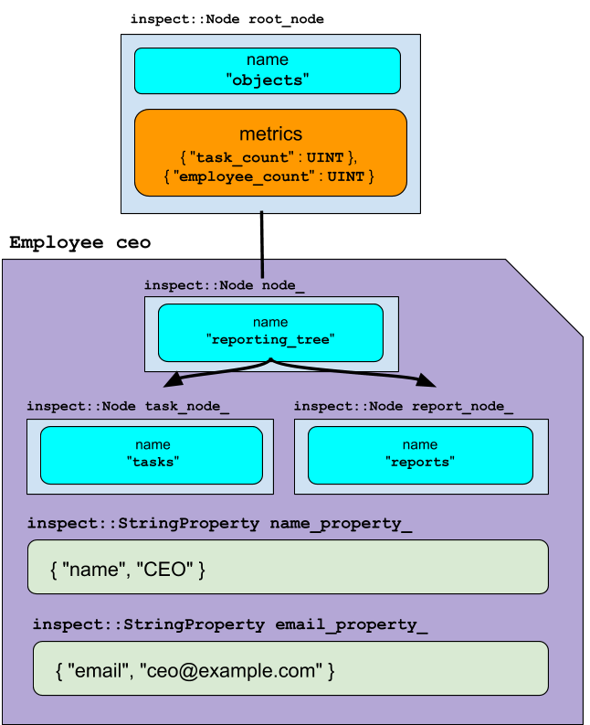

<!-- source for images is https://docs.google.com/document/d/1ykMBMDLKxKDpn9UnYtHYU3iJusAeNC4Aeijcra5qi-Y/edit?usp=sharing -->

Getting Started with Fuchsia's Inspect API
=====

The Fuchsia **Inspect API** allows your program to provide structured
information in an abstract, language-independent format for the use of
other programs and services.

This document is a "Getting Started" guide to give you:
* an overview of what the Inspect API does and how it works,
* an introduction to what your program needs to provide in order to work with the API, and
* some use-cases to fire your imagination.

It includes two "quick starts" as well, for
[writing a new component](#i_m-writing_a_new_component) and
[modifying an existing component](#i_m-modifying-an-existing-component).

[TOC]

# Overview

[Inspect][inspect] can be thought of as being at the top of a "get data from a program" pile:



At the bottom level, logging just blindly spits out fixed data.
It usually goes to some kind of a system logger, and ends up in a log file.
In terms of complexity, it's the simplest to implement (usually via a **printf()**-like
function call).

Tracing provides more control: it can be turned on and off, and you can select the data
set that you want to extract at run time.
Clients can be more sophisticated with their control and consumption of tracing data.

Inspect, on the other hand, provides a hierarchical, structured view of the program's
runtime data, allowing inspection to occur in an ad-hoc manner.
However, it does take more effort to implement.

> More intrusive inspection of the program is possible, of course &mdash; various debuggers,
> like [`zxdb`][zxdb], allow any memory location in the program to be accessed.
> But the data is accessed more "in spite of" the program, rather than cooperatively.

# A simple example

In this tutorial, we're going to use a persistent "black box" program for our examples.

The key concept here is that the program knows its own state and organization best,
so it's the one that publishes it.

We're going to see how to organize the data in your program so that it's readily
accessible to Inspect (and that it's organized in a logical manner).

## An employee management system

Our example program is an employee management system.
The program manages its own state.

The system keeps track of a corporation's employees.
Each employee has a record that contains the following data:
* employee's name,
* employee's email address,
* a list of tasks (if any).
* a list of direct reports (if any).

> Note that the email address is used as a key, and is unique.

To give you a big picture:



> The source code for this example is in
> [`//garnet/public/lib/inspect/integration/example.cc`][example.cc].

First, let's look at the internal organization of the data from `example.cc`
(line identifiers are local to the description, not the actual file):

```c++
[E01] class Employee {
[E02] ...
[E03]  private:
[E04]  std::string name_;
[E05]  std::string email_;
[E06]
[E07]   // Vector of |Task|s assigned to this |Employee|.
[E08]   std::vector<std::unique_ptr<Task>> tasks_;
[E09]
[E10]   // Vector of |Employee|s reporting to this |Employee|.
[E11]   std::vector<std::unique_ptr<Employee>> reports_;
[E12]
[E13]   // Node under which this |Employee| can expose inspect information.
[E14]   inspect::Node node_;
[E15]
[E16]   // Properties for name and email.
[E17]   inspect::StringProperty name_property_;
[E18]   inspect::StringProperty email_property_;
[E19]
[E20]   // Node under which this |Employee| nests |Task|s.
[E21]   inspect::Node task_node_;
[E22]
[E23]   // Node under which this |Employee| nests reporting |Employee|s.
[E24]   inspect::Node report_node_;
[E25]
[E26]   // Container for various computed "Lazy" metrics we wish to expose.
[E27]   std::vector<inspect::LazyMetric> lazy_metrics_;
[E28] };
```

Or, visually:



We've divided the `Employee` class into two parts (separated by the dashed line in the diagram);
the part on the right contains the "native database" members, and consists of:
* `name_` (`[E04]`) &mdash; the employee's name (`std::string`),
* `email_` (`[E05]`) &mdash; the employee's email (`std::string`),
* `tasks_` (`[E08]`) &mdash; a list of tasks assigned to the employee
  (`vector<std:unique_ptr<Task>>`), and
* `reports_` (`[E11]`) &mdash; a hierarchy of direct reports
  (`vector<std::unique_ptr<Employee>>`).

The part on the left consists of the Inspect members:
* `node_` (`[E14]` &mdash; binding for the Inspect framework (`inspect::Node`),
* `name_property_` (`[E17]`) &mdash; the employee's name as an inspect "string"
  property (`inspect::StringProperty`),
* `email_property_` (`[E18]`) &mdash; the employee's email (`inspect::StringProperty`),
* `task_node_` (`[E21]`) &mdash; Inspect framework binding to subordinate tasks
  (`inspect::Node`),
* `report_node_` (`[E24]`) &mdash; Inspect framework binding to subordinate
  reports (`inspect::Node`), and
* `lazy_metrics_` (`[E27]`) &mdash; information about the employee's metrics
 (`vector<inspect::LazyMetric>`).

We'll forgo discussing the "native database" part of the implementation in depth; it's standard C++.

> It's important to keep in mind that we have two hierarchies of employee and task
> information: one is maintained by the "native database" part (via the `vector`s of
> `Employee`s and `Task`s), and the other is maintained by the Inspect nodes
> (`node_`, `task_node_`, and `report_node_`).
>
> Philosophically, we *want* to keep the two representations distinct &mdash; what gets
> presented to the Inspect interface may not necessarily map one-to-one with the internal
> representation, for a number of reasons.
> For example, we might have additional information we don't want to expose,
> or the internal representation may be optimized for the application rather than
> for presentation, etc.

In our example, we use the following Inspect types:

Type                      | Use
--------------------------|-----------------------------------
`inspect::Node`           | A node under which properties, metrics, and other nodes may be nested
`inspect::StringProperty` | Property with value given by a string
`inspect::LazyMetric`     | A named metric, with the value determined by evaluating a callback

### Creating the root node

The root node is where the data set for Inspect begins.
There's a little bit of housekeeping in **main()** that gets that going:

```c++
int main(int argc, const char** argv) {
  // Standard component setup, create an event loop and obtain the
  // |StartupContext|.
  async::Loop loop(&kAsyncLoopConfigAttachToThread);
  auto context = component::StartupContext::CreateFromStartupInfo();

  // Create a root node from the context's object_dir.
  inspect::Node root_node(*context->outgoing().object_dir());
```

The `async::Loop` object creates the event loop for the component.
Event loops are responsible for serving interfaces exposed by this component, including Inspect.

Calling **component::StartupContext::CreateFromStartupInfo()** provides a
common set of interfaces to the environment this component is running in.
One of these interfaces is for Inspection, and the root node of this
interface is obtained by wrapping the outgoing **object_dir()**.

Once the `root_node` is created, we add some named metric counters to it:

```c++
  // Create global metrics and globally publish pointers to them.
  auto employee_count = root_node.CreateUIntMetric("employee_count", 0);
  auto task_count = root_node.CreateUIntMetric("task_count", 0);
  auto cleanup = SetGlobals(&employee_count, &task_count);
```

We'll come back to the [global metric counters later](#global-metrics).

And now we can populate the hierarchy.
We'll start with the CEO:

```c++
  // Create a CEO |Employee| nested underneath the |root_node|.
  // The name "reporting_tree" will appear as a child of the root node.
  Employee ceo("CEO", "ceo@example.com", root_node.CreateChild("reporting_tree"));
```

The `ceo` node is the root of both our native database and the parallel Inspect
hierarchy (at `root_node`).
The `Employee` constructor (starting at line `[M06]`, below) shows us how that's done:

```c++
[M01] class Employee {
[M02]  public:
[M03]   // Create a new |Employee|.
[M04]   // Note that the constructor takes an |inspect::Node| that we may use to
[M05]   // expose our own metrics, properties, and children nodes.
[M06]   Employee(std::string name, std::string email, inspect::Node node)
[M07]       : name_(std::move(name)),
[M08]         email_(std::move(email)),
[M09]         node_(std::move(node)) {
[M10]     // Increment the global employee count.
[M11]     CountEmployees(1);
[M12]
[M13]     // Create an |inspect::StringProperty| for the name and email of this
[M14]     // employee.
[M15]     name_property_ = node_.CreateStringProperty("name", name_);
[M16]     email_property_ = node_.CreateStringProperty("email", email_);
[M17]     // |Task| nodes are nested under another child node, called "tasks".
[M18]     task_node_ = node_.CreateChild("tasks");
[M19]     // Each |Employee| reporting to this |Employee|  are nested under another
[M20]     // child node, called "reports".
[M21]     report_node_ = node_.CreateChild("reports");
...
```

The arguments to the constructor are:

Argument | Meaning
---------|--------
`name`   | The name of the employee ("CEO")
`email`  | The employee's email address ("ceo@example.com")
`node`   | The Inspect object associated with this node

The `node` that we passed was generated by calling
`root_node.CreateChild("reporting_tree")`.
This creates a child node, "reporting_tree", and it's this child
node that is now associated with the CEO's node.

This is what we've built so far (omitting the native database part):



### Adding more reports

Let's add a few more direct reports to get the flavor of how this works:

```c++
  // Create some reports for the CEO, named Bob, Prakash, and Svetlana.
  auto* bob = ceo.AddReport("Bob", "bob@example.com");
  auto* prakash = ceo.AddReport("Prakash", "prakash@example.com");
  auto* svetlana = ceo.AddReport("Svetlana", "svetlana@example.com");

  // Bob has 3 reports: Julie, James, and Jun.
  bob->AddReport("Julie", "julie@example.com");
  bob->AddReport("James", "james@example.com");
  bob->AddReport("Jun", "jun@example.com");
```

We've allocated variables for Bob, Prakash, and Svetlana because we're going
to be doing more work with them later; but Julie, James, and Jun don't get stored
in local variables, because we have no further need for them.
We could always fetch them later by following the hierarchy if we wanted to.

The `Employee` class has a member function, **AddReport()**, that takes two strings,
a name and an email, and adds them to both hierarchies:

```c++
[A01] class Employee {
[A02]  public:
[A03] ...
[A04]   // Add a new |Employee| reporting to this |Employee|.
[A05]   Employee* AddReport(std::string name, std::string email) {
[A06]     return reports_
[A07]         .emplace_back(std::make_unique<Employee>(
[A08]             std::move(name), std::string(email),
[A09]             // Note: We need to pass a Node linked under this Node into the
[A10]             // new child. We use the |email| directly, since elsewhere we
[A11]             // guarantee everyone's emails are unique.
[A12]             report_node_.CreateChild(std::move(email))))
[A13]         .get();
[A14]   }
```

We call **emplace_back()** to take the newly created `Employee` node (constructed on `[A07]`)
and add it to the end of the native database vector `reports_`.
We called the Inspect function **CreateChild()** to create a new child node, which is stored
by the constructor (via `node_(std::move(node))` on line `[M09]` in the `Employee`
constructor code from the previous sample.)

### Chaining

The **AddReport()** member function is structured so that it returns a pointer to the newly
added record; this makes it easy to chain multiple actions:

```c++
  // Prakash has two reports: Gerald and Nathan.
  prakash->AddReport("Gerald", "gerald@example.com");

  // Nathan is an intern, so assign him a task to complete his training.
  prakash->AddReport("Nathan", "nathan@example.com")
      ->AddTask("ABC-12", "Complete intern code training")
      ->SetCompletion(1);
```

In Gerald's case, we ignore the return value from **AddReport()**.
We have no further actions to do here.
But we do make use of it in Prakash's case to call **AddTask()**.

**AddTask()** is structured similarly: it returns a pointer to the newly created `Task`
element, so that we can chain a call to **SetCompletion()**.

From the Inspect point of view, **AddTask()** does the same kind of work as **AddReport()**,
that is, it adds a child node via **CreateChild()** (line `[T25]` below):

```c++
[T01] class Employee {
[T02]  public:
[T03] ...
[T04]   Task* AddTask(std::string bug_number, std::string name) {
[T05]     size_t least_loaded_count = GetTaskCount();
[T06]     Employee* least_loaded_employee = this;
[T07]
[T08]     // Iterate over reports to find the report with the least number of existing
[T09]     // tasks.
[T10]     for (auto& report : reports_) {
[T11]       if (report->GetTaskCount() <= least_loaded_count) {
[T12]         least_loaded_count = report->GetTaskCount();
[T13]         least_loaded_employee = report.get();
[T14]       }
[T15]     }
[T16]
[T17]     if (least_loaded_employee == this) {
[T18]       // If this |Employee| is the least loaded, take the |Task|...
[T19]       return tasks_
[T20]           .emplace_back(std::make_unique<Task>(
[T21]               std::move(bug_number), std::move(name),
[T22]               // Note: We need to pass a Node linked under this Node into
[T23]               // the new child. We use |inspect::UniqueName| to assign a
[T24]               // globally unique suffix to the child's name.
[T25]               task_node_.CreateChild(inspect::UniqueName("task-"))))
[T26]           .get();
[T27]     } else {
[T28]       // ... otherwise, recursively add the |Task| to the least loaded report.
[T29]       return least_loaded_employee->AddTask(std::move(bug_number),
[T30]                                             std::move(name));
[T31]     }
[T32]   }
```

As you can see, though, **AddTask()** does a lot more work on the native database side.

### Global metrics

One of the very first things we did in **main()** was we attached two metrics, "employee_count"
and "task_count" (as unsigned integers) to the root node:

```c++
  // Create global metrics and globally publish pointers to them.
  auto employee_count = root_node.CreateUIntMetric("employee_count", 0);
  auto task_count = root_node.CreateUIntMetric("task_count", 0);
  auto cleanup = SetGlobals(&employee_count, &task_count);
```

We call these "global" because they apply to the entire database; `employee_count`
tells us the total number of employees in the hierarchy, and `task_count` tells
us the total number of tasks.

The values of these metrics are available (via Inspect) from the root node.

The values themselves are updated via the various member functions as employees
and tasks get added or deleted.

> This is another example of a "disjoint" database &mdash; the "native database"
> doesn't have the concept of "employee count" or "task count", it simply
> doesn't need it.
> But the Inspect hierarchy provides it for external consumption.

### Lazy metrics

Recall that our `Employee` class has a vector of `inspect::LazyMetric` values,
called `lazy_metrics_`.
There are two lambda functions associated with the metrics, one to compute
"personal_performance" and one for "report_performance" metrics.

#### Personal performance metric

The computation of the personal performance lazy metric is achieved by
binding a lambda function (lines `[P08` .. `P13]` below) via the Inspect function
**CreateLazyMetric()**:

```c++
[P01]class Employee {
[P02] public:
[P03]...
[P04]    // Create an |inspect::LazyMetric| for this |Employee|'s personal
[P05]    // performance. The "personal_performance" of an |Employee| is the average
[P06]    // completion of their |Task|s.
[P07]    lazy_metrics_.emplace_back(node_.CreateLazyMetric(
[P08]        "personal_performance", [this](component::Metric* out) {
[P09]          // Callbacks have an "out" parameter that is set to the desired value.
[P10]          // In this case, set it to the double value of our
[P11]          // |EmployeePerformance|.
[P12]          out->SetDouble(GetPerformance().CalculateCompletion());
[P13]        }));
```

The lambda function gets passed the node (via `this`) and is expected to return
the value through the `out` pointer.
The actual computation is handled by a native database **CalculateCompletion()** function,
which returns a `double`.
This `double` value is then stored in `out` by an Inspect member function **SetDouble()**
on line `[P12]`.

#### Report performance metric

To compute the report performance, similar code is used:

```c++
[R01]class Employee {
[R02] public:
[R03]...
[R04]    // Create an |inspect::LazyMetric| for the performance of this
[R05]    // |Employee|'s reports. The "report" performance of an |Employee| is the
[R06]    // average completion of all |Task|s assigned to their direct reports.
[R07]    lazy_metrics_.emplace_back(node_.CreateLazyMetric(
[R08]        "report_performance", [this](component::Metric* out) {
[R09]          // Add together the performance for each report, and set the result in
[R10]          // the out parameter.
[R11]          EmployeePerformance perf = {};
[R12]          for (const auto& report : reports_) {
[R13]            perf += report->GetPerformance();
[R14]          }
[R15]          out->SetDouble(perf.CalculateCompletion());
[R16]        }));
[R17]  }
```

Here, the lambda function (`[R08` .. `R16]`) uses the class `EmployeePerformance`
to accumulate the performance over all the reports.
It too returns a `double` value, in the same way as the "personal performance" lambda above.

# Using iquery

The [`iquery`][iquery] tool allows you to look at the Inspect database.

You first need to find your program &mdash; that is, you need to see where it
got registered after startup.

```
$ iquery --find /hub
/hub/c/sysmgr.cmx/4248/out/objects
/hub/c/sysmgr.cmx/4248/system_objects
/hub/r/sys/4566/c/http.cmx/19226/out/objects
/hub/r/sys/4566/c/http.cmx/19226/system_objects
...
/hub/r/sys/4566/c/libinspect_example_component.cmx/8123/out/objects
/hub/r/sys/4566/c/libinspect_example_component.cmx/8123/system_objects
...
```

The above command cause `iquery` to find all the processes that have registered with `/hub`
as providing Inspect data.
The output has been shortened for the example.

The last two lines shown, containing `libinspect_example_component.cmx`,
correspond to our employee database example.
The `8123` is the process ID of the employee database, and there are two paths
containing nodes:

Path             | Meaning
-----------------|-------------------------------------------
`out/objects`    | our exposed Inspect data nodes
`system_objects` | system nodes

The `system_objects` entry is populated by `appmgr` and includes
information about the process itself (open handles, memory information,
CPU registers, shared objects, and so on) &mdash; so we'll skip that one.

The `out/objects` tree is the information exposed by the component itself
(which is the tree from our example above).

To view the employee database's exposed nodes, you can run `iquery` with the
`--recursive` command line option:

```
$ iquery --recursive /hub/r/sys/4566/c/libinspect_example_component.cmx/8123/out/objects
objects:
  task_count = 16
  employee_count = 12
  reporting_tree:
    email = ceo@example.com
    name = CEO
    report_performance = 0.525000
    personal_performance = 1.000000
    reports:
...
```

This dumps the two public global metrics (`task_count` and `employee_count` that we
created in "[Global metrics](#global-metrics)" above) as well as the `reporting_tree`
hierarchy.

Because we specified `--recursive`, `iquery` descends into each branch and dumps
the information on that branch recursively.

If you wanted to dump the data in JSON (perhaps for some post processing), you
can specify the `--format=json` parameter to `iquery`:

```
$ iquery --recursive --format=json /hub/r/sys/4566/c/libinspect_example_component.cmx/8123/out/objects
[
  {
    "path": "objects",
    "contents": {
      "objects": {
        "task_count": "16",
        "employee_count": "12",
        "reporting_tree": {
          "email": "ceo@example.com",
          "name": "CEO",
          "report_performance": "0.525000",
          "personal_performance": "1.000000",
          "reports": {
...
```

<!--
# Details

- look at the FIDL API

# Quick starts

If you want to jump in and get going, the following sections are intended to give you
a quick start on [writing a new component](#) and [modifying an existing component](#).
Cross references are provided back to the appropriate "Getting Started" section above
for topics you may wish to learn about (or revisit).

## I'm writing a new component...

> Show how to architect a new component to include inspection support from the beginning.
> Should link to some skeleton code.

## I'm modifying an existing component...

> Show how to add inspection into an existing component, and properly pipe through the needed nodes.

# From the "Inspection Documentation Scope" document

> Demonstrate how to read inspection data out of the black box component.
> Note: We have received feedback that understanding "where and how" to read inspection data is a significant pain point.
> This must be emphasized.
> Walkthrough on how to expose inspection data on the hub, with examples of using iquery to inspect that state.

From Chris:

    The audience for inspect is frequently unfamiliar with components themselves,
    so readers will need more explanation of what is going on (they just want
    to run programs and get data, but we end up forcing them to grapple with
    "component" concepts). I'll explain my understanding of it:

    The example app is built as a component here
    <https://fuchsia-review.googlesource.com/c/fuchsia/+/251575/2/garnet/public/lib/inspect/integration/BUILD.gn#51>.
    This means it has a component manifest here
    <https://fuchsia-review.googlesource.com/c/fuchsia/+/251575/2/garnet/public/lib/inspect/integration/meta/libinspect_example_component.cmx>.
    The manifest is standard boilerplate specifying which binary to run when
    the component is started, and says it has access to the Launcher and
    Environment services (this part may not be necessary, I'll take a look at
    it).

    We include the libinspect_example_component component in the "tests" group here
    <https://fuchsia-review.googlesource.com/c/fuchsia/+/251575/2/garnet/packages/tests/all#54>
    by
    including the file we defined here
    <https://fuchsia-review.googlesource.com/c/fuchsia/+/251575/2/garnet/packages/tests/libinspect_integration_tests>.
    Now a Fuchsia build including the Garnet tests package will include our
    component.

    We first need to start our component on the Fuchsia system using:

    $ run -d fuchsia-pkg://
    fuchsia.com/libinspect_integration_tests#meta/libinspect_example_component.cmx

    This specifies the URL of the package and #meta/libinspect_example_component.cmx
    specifies which component inside the package to run. run -d starts the
    component in the background.

    We can use the iquery tool to find all inspectable components on the system
    from the hub:

    $ iquery --find /hub

    This gives the path to every inspect tree available. Now the output will
    differ depending on whether this was run through `fx shell` or directly on
    the target. `fx shell` logs the user into the "sys" realm. If you use fx
    shell you will see:

    /hub/c/libinspect_example_component.cmx/<process_id>/out/objects
    /hub/c/libinspect_example_component.cmx/<process_id>/system_objects

    If you directly type in the target you will see:

    /hub/r/sys/<realm_id>/c/libinspect_example_component.cmx/<process_id>/out/objects
    /hub/r/sys/<realm_id>/c/libinspect_example_component.cmx/<process_id>/system_objects

    There are two node trees exposed for the example. The system_objects tree
    is populated by appmgr and includes data about the process itself (open
    handles, memory in use, stack dumps). The out/objects tree is the
    information exposed by the component itself (which is the tree we are
    describing in the example!).

    A comprehensive command to automatically find your component and output its
    nodes is:

    $ iquery --recursive `iquery --find /hub | grep libinspect_example_component.cmx
    | grep out/objects`

    This will find the component wherever it is and output its information.


    From the host, fx debug-report finds all nodes on the system and includes
    it in a report:

    $ fx debug-report
    $ fx debug-report -s   # include system nodes with -s
    $ fx debug-report -f json  # set format using -f
-->

<!-- cross references -->
[iquery]: /docs/development/inspect/iquery.md
[inspect]: /docs/development/inspect/README.md
[zxdb]: /docs/development/debugger/README.md
[example.cc]: /garnet/public/lib/inspect/integration/example.cc
