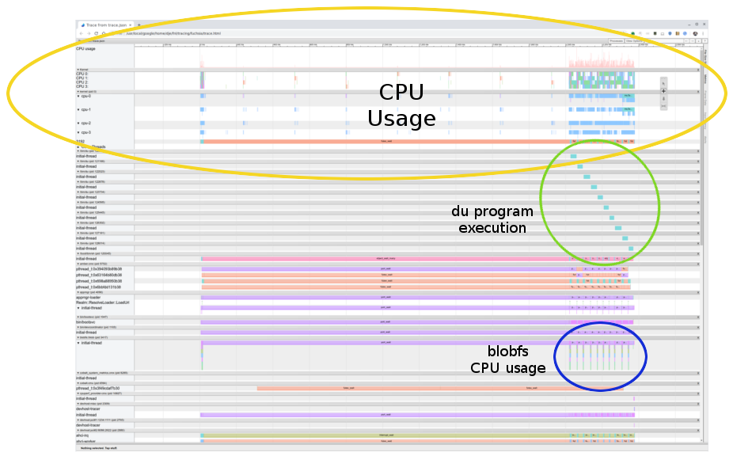
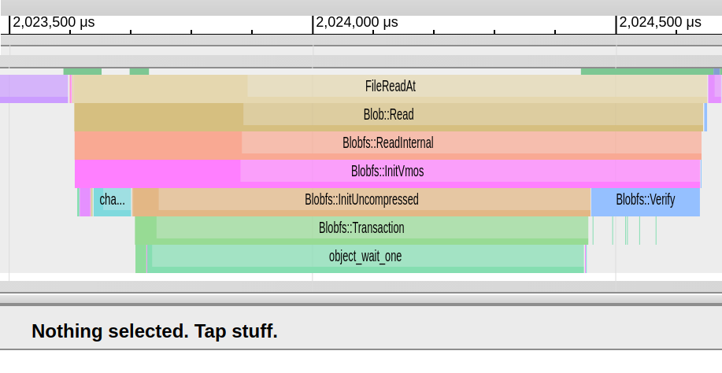
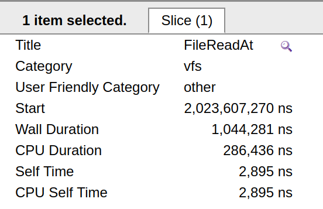
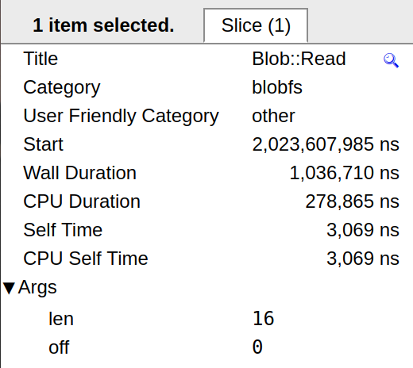

# Fuchsia Tracing Quick Start

This document describes how to generate and visualize traces using
Fuchsia's Tracing System.

For more in-depth documentation see the [table of contents](README.md).

## Collecting A Trace

Tracing is typically collected with the `traceutil` program run from your
development host. The simplest invocation is:

```shell
$ fx traceutil record
```

That will collect 10 seconds of trace data using the default set of
categories, which is enough for basic graphics data and thread cpu usage.

The will produce an HTML file that you can view in Chrome.

## Collection Example

In this example, we want to see what the system is doing when we run the `du`
(show disk usage) command.

We will show this using the `QEMU` version of Fuchsia, hosted on a Linux box.

First, on the Linux box, we start Fuchsia:

```shell
linux-shell-1$ fx run -k -N
```

This configures and runs Fuchsia.
After Fuchsia comes up, you can run the `traceutil` program in another Linux
shell:

```shell
linux-shell-2$ fx traceutil record --buffer-size=64 \
    --categories=all --spawn \
    /boot/bin/sh -c "'\
        sleep 2 ;\
        i=0 ;\
        while [ \$i -lt 10 ] ;\
        do /bin/du /boot ;\
            i=\$(( \$i + 1 )) ;\
        done'"
```

> Note that the extra quoting and backslashes are required because the command
> string has to travel through two shells (first the Linux shell and then the
> native Fuchsia shell).
> Some fonts don't render the above code sample well, so note that the ordering
> is double-quote then single-quote on the first line, and the opposite on
> the last line.

This invokes the `traceutil` utility with the following command line options:

* `record` &mdash; instructs the `trace` utility to begin recording.
* `--buffer=size=64` &mdash; specifies the buffer size, in megabytes, for the
  recording buffer.
* `--categories=all` &mdash; specifies the collection of all trace categories.
* `--spawn` &mdash; instructs the `trace` utility to launch the program with
  **fdio_spawn()**.

The command that we're tracing is a small shell script.
The shell script waits for 2 seconds (the `sleep 2`) and then enters a `while`
loop that iterates 10 times.
At each iteration, the `du` command is invoked to print out how much disk space
is used by `/boot`, the loop variable `i` is incremented, and the `while` condition
is re-evaluated to see if the loop is done.

This produces an HTML trace file in the current directory.

## Visualizing A Trace

To visualize the trace, load the HTML file into Chrome, just as you would
any other local file.
For example, if the file lives in `/tmp/trace.html` on your machine, you can
enter a URL of `file:///tmp/trace.html` to access it (note the triple forward slash).

The display will now show:



You'll notice that this page has a ton of detail!
Although not visible from this high level view, there's a tiny
time scale at the very top, showing this entire trace spans about
2 and a half seconds.

> At this point, you may wish to familiarize yourself with the navigation
> controls.
> There's a small **`?`** icon near the top right of the screen.
> This brings up a help window.
> Some important keys are:
>
> * `w` and `s` to zoom in and out,
> * `W` and `S` to zoom in/out by greater steps,
> * `a` and `d` to pan left and right, and
> * `A` and `D` to pan left/right by greater steps.
>
> Zooming in is centered around the current mouse position; it's a little
> strange at first but really quite handy once you get used to it.

In the sample above, the yellow circle shows the CPU usage area.
Here you can see the overall CPU usage on all four cores.

The "staircase" pattern on the right, indicated by the green circle,
is the `du` program's execution.

Notice that there are 10 invocations of the `du` command &mdash; we expected
this because our `while` loop ran 10 times, and started a **new** `du`
process each time.
Therefore, we get 10 new `du` process IDs, one after the other.

The real power of tracing is the ability to see correlations and drill
down to see where time is spent.
Notice the bottom right part of the image, with the blue circle titled "blobfs CPU usage"
Here you see little bursts of CPU time, with each burst seemingly related to
a `du` invocation.

Of course, at this high level it's hard to tell what the exact correlation is.
Is the cpu usage caused by the **loading** of `du` from the filesystem?
Or is it caused by the **execution** of `du` itself as it runs through the target
filesystem to see how much space is in use?

Let's zoom in (a lot!) and see what's really going on.

> Chrome tracing allows you to deselect ("turn off") process rows.
> In order to make the diagram readable, we've turned off a bunch of processes
> that we weren't interested in. This is done via a little "x" icon at the far
> right of each row.


In the above, we see just two `du` program executions (the first is highlighted
with a green oval at the top of the image, and the second follows it below).
We deleted the other `du` program executions in order to focus.

Notice also that the first `blobfs` cpu burst actually consist of three main
clusters and a bunch of little spikes (subsequent `blobfs` cpu bursts have two
clusters).

At this point, we can clearly see that the `blobfs` bursts are **before** the
`du` program invocation.
This rules out our earlier supposition that the `blobfs` bursts were the
`du` program reading the filesystem.
Instead, it confirms our guess that they're related to loading the `du` program
itself.

Let's see what's *really* going on in the `blobfs` burst!



We've cropped out quite a bit of information so that we could again focus on just
a few facets.
First off, notice the time scale.
We're now dealing with a time period spanning from 2,023,500 microseconds from
beginning of tracing through to just past 2,024,500 &mdash; that is, a bit
more than 1,000 microseconds (or 1 millisecond).

During that millisecond, `blobfs` executed a bunch of code, starting with something
that identified itself as `FileReadAt`, which then called `Blob::Read`, which
then called `Blob::ReadInternal` and so on.

To correlate this with the code, we need to do a little bit more digging.
Notice how at the bottom of the image, it says "Nothing selected. Tap stuff."

This is an invitation to get more information on a given object.

If we "tap" on top of the `FileReadAt`, we see the following:



This tells us a few important things.

1. The `Category` is `vfs` &mdash; categories are a high level grouping created
   by the developers in order to keep functionality together. Knowing that it's
   in the `vfs` category allows us to search for it.
2. We get the high resolution timing information. Here we see exactly how long
   the function executed for.

> For the curious reader, you could look at
> [//zircon/system/ulib/fs/connection.cpp][connection] and see exactly how the
> tracing is done for `FileReadAt` &mdash; it's a slightly convoluted macro
> expansion.

Things are even more interesting with `Blob::Read`:



It lives in
[//zircon/system/ulib/blobfs/blob.cpp][blob], and is very short:

```cpp
zx_status_t Blob::Read(void* data,
                       size_t len,
                       size_t off,
                       size_t* out_actual) {
    TRACE_DURATION("blobfs", "Blob::Read", "len", len, "off", off);
    LatencyEvent event(&blobfs_->GetMutableVnodeMetrics()->read,
                       blobfs_->CollectingMetrics());

    return ReadInternal(data, len, off, out_actual);
}
```

Notice how it calls **TRACE_DURATION()** with the category of `blobfs`,
a name of `Blob::Read`, and two additional, named arguments: a length and
an offset.

These conveniently show up in the trace, and you can then see the offset
and length where the read operation was taking place!

The tracing continues, down through the layers, until you hit the last one,
`object_wait_one`, which is a kernel call.

## More on Chrome's Tracing

For documentation on using Chrome's trace view [see here][chrome].

<!-- xrefs -->
[blob]: /zircon/system/ulib/blobfs/blob.cpp
[chrome]: https://www.chromium.org/developers/how-tos/trace-event-profiling-tool
[connection]: /zircon/system/ulib/fs/connection.cpp
