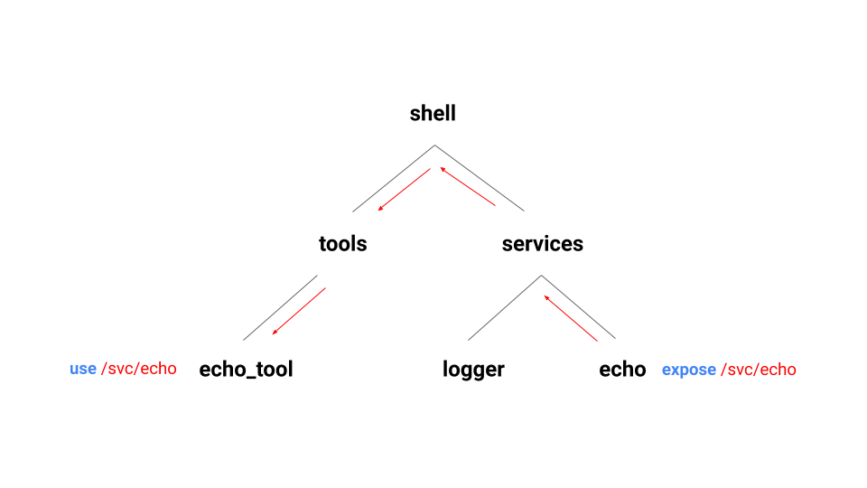
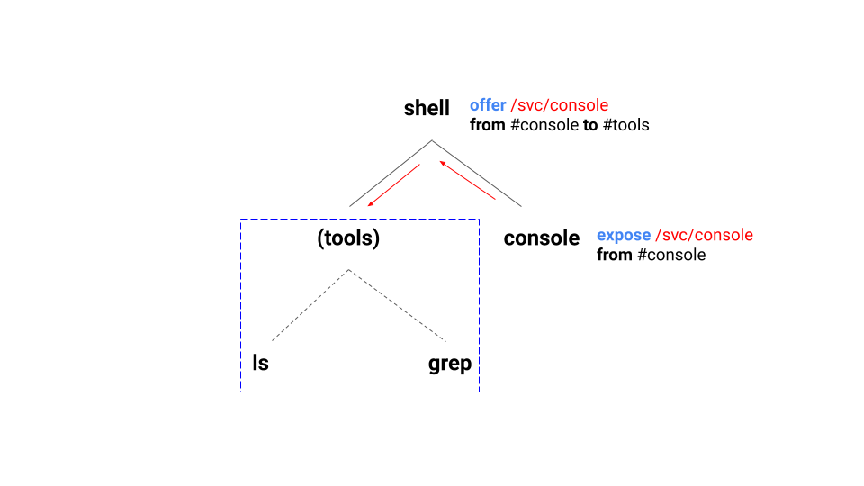

# Realms

A *realm* is a subtree of the component instance tree. Every component instance
is the root instance of a realm, known as the "component instance's realm",
which is closely associated with the component instance.

TODO: link to component instance tree

Component instances may contain [children](#child-component-instances). Each
child component instance in turn defines its own sub-realm. The union of these
sub-realms, along with the parent component instance, is equivalent to a
subtree. Therefore, it is common to conceive of a realm as a component instance
along with its set of children.

Realms play a special role in the component framework. A realm is an
*encapsulation boundary* for component instances. This means:

* Realms act as a capability boundary. It's up to the realm to decide whether a
  capability originating in the realm can be routed to component instances
  outside of the realm. This is accomplished through an [`expose`][expose]
  declaration in a [component manifest][component-manifests].
* The internal structure of a [sub-realm](#definitions) is opaque to the parent
  component instance. For example, the sub-realm could be structured either as
  one or multiple component instances, and from the perspective of the parent
  component instance this looks the same as long as the sub-realm
  [exposes][expose] the same set of capabilities.

## Definitions

This section contains definitions for basic terminology about realms.

- A *realm* is a subtree of the component instance tree.
- A *child component instance* is a component instance that is owned by another
  instance, the *parent*.
- A *sub-realm* is the realm corresponding to a child component instance.
- A *containing realm* is the realm corresponding to the parent of a component
  instance.

## Example

Here is an example of a realm with a capability routed through it:

In this example, the `shell` component has two children: `tools` and `services`.
`services` has two children, `logger` and `echo`, while `tools` has one child
`echo_tool`. Components encapsulate their children, so while the `shell`
component sees its own children, it has no direct knowledge of its grandchildren
`echo_tool`, `logger`, or `echo`. Nevertheless, all of these component instances
are considered part of the `shell` realm.

The red arrows illustrate the path of an `/svc/echo` service capability that is
routed through the realm from `echo` to `echo_tool`. The upward arrows
correspond to [`expose`][expose] declarations, while the downward arrows
represent [`offer`][offer] declarations. The `expose` declarations cause
`/svc/echo` to be exposed outside of the capability boundary of the
corresponding realms.  For example, if `services` did not expose `/svc/echo`,
`shell` would not be aware that `/svc/echo` exists, and could not offer the
service to its children or access it at runtime.

For a more detailed walkthrough of capability routing with this example, see
the [component manifest capability routing example][component-manifest-examples].

## Child component instances

Component instances may contain children. Child component instances are
considered part of the parent instance's definition and are wholly owned by the
parent. This has the following implications:

- A component instance decides what children it contains, and when its children
  are created and destroyed.
- A component instance cannot exist without its parent.
- A component instance may not execute unless its parent is executing.
- A component instance determines the capabilities available to its children by
  making [`offer`](#offer) declarations to them.
- A component instance has some degree of control over the behavior of its
  children. For example, a component instance may bind to capabilities exposed
  from the child's realm through the [`Realm`](#the-realm-framework-service)
  framework service, or set hooks to intercept child lifecycle events. This
  control is not absolute, however. For example, a component instance cannot use
  a capability from a sub-realm that was not explicitly exposed to it.

There are two varieties of child component instances, [static](#static-children)
and [dynamic](#dynamic-children).

### Static children

A *static child* is a component instance that was statically declared in the
component's [manifest][component-manifests] by a [`children`][children]
declaration. This declaration is necessary and sufficient to establish the child
component instance's existence.

Typically, a child should be statically declared unless it has a reason to be
dynamic (see [Dynamic children](#dynamic-children)). When a child is statically
declared, its definition and capabilities can be audited and capabilities can be
statically routed from it.

A static child is defined, foremost, by two pieces of information:

- The child instance's *name*. The name is local to the parent component
  instance, and is used to form monikers. It is valid to declare multiple
  children with the same URL and different names.
- The child instance's component URL.

For information on providing additional configuration information to child
declarations, see [children][children].

TODO: link to component URL

TODO: link to monikers

### Dynamic children

A *dynamic child* is a component instance that was created at runtime in a
[component collection](#component-collections). A dynamic child is always scoped
to a particular collection. Dynamic children can be used to support use cases
where the existence or cardinality of component instances cannot be determined
in advance. For example, a testing realm might declare a collection in which
test component instances can be created.

Most of the metadata to create a dynamic child is identical to that used to
declare a static instance, except that it's provided at runtime. The name of a
dynamic child is implicitly scoped to its collection; thus it is possible to
have two dynamic children in two different collections with the same name.

Capabilities cannot be statically routed from dynamic instances. This is an
inherent restriction: there's no way to statically declare a route from a
capability exposed by a dynamic instance. However, certain capabilities can be
routed from the collection as a whole. TODO: service directories as an example

### Component collections

A *collection* is a container for [dynamic children](#dynamic-children) which
may be created and destroyed at runtime using the
[Realm](#the-realm-framework-service) framework service.

Collections support two modes of *durability*:

- *Transient*: The instances in a *transient* collection are automatically
  destroyed when the instance containing the collection is stopped.
- *Persistent*: The instances in a *persistent* collection exist until they are
  explicitly destroyed or the entire collection is removed. [meta
  storage][glossary-storage] must be offered to the component for this option to
  be available.

TODO: Link to lifecycle

Collections are declared in the [`collections`][collections] section of a
component manifest. When an [`offer`][offer] declaration targets a collection,
the offered capability is made available to every instance in the collection.
Some capabilities can be exposed or offered from the collection as a whole, as
an aggregation over the corresponding capabilities exposed by the instances in
the collection.

TODO: service directories as an example

#### Example

The following diagram illustrates a realm with a collection:

In this example, the `shell` component declares a static child `console` and a
collection `(tools)`, highlighted by the dashed blue rectangle (the `()`
notation denotes a collection). `(tools)` contains two dynamic instances, `ls`
and `grep`. These instances are dynamic children of `shell`, scoped to
`(tools)`. The use of a collection implies that the existence of `ls` and `grep`
is not known in advance. This is plausible if you imagine that `ls` and `grep`
are command-line tools that are instantiated on demand as the user requests
them.

The example also illustrates a capability routing path with the red arrows.
First, `console` [exposes][expose] `/svc/console` to its containing realm
`shell`, which [offers][offer] it to `(tools)`. `/svc/console` then becomes
available for any component instance in the collection to [use][use] -- it does
not need to be routed to the dynamic instances independently.

## The Realm framework service

There is a [framework service][framework-services] available to every component,
[`fuchsia.sys2.Realm`][realm.fidl]. The `Realm` service provides APIs for a
component instance to manage the children in its realm, such as binding to
children and creating dynamic children. See the linked FIDL definitions for full
documentation.

[children]: ./component_manifests.md#children
[collections]: ./component_manifests.md#collections
[component-manifests]: ./component_manifests.md
[component-manifest-examples]: ./component_manifests.md#examples
[expose]: ./component_manifests.md#expose
[framework-services]: ./component_manifests.md#framework-services
[glossary-storage]: /docs/glossary.md#storage-capability
[offer]: ./component_manifests.md#offer
[realm.fidl]: /sdk/fidl/fuchsia.sys2/realm.fidl
[use]: ./component_manifests.md#use
