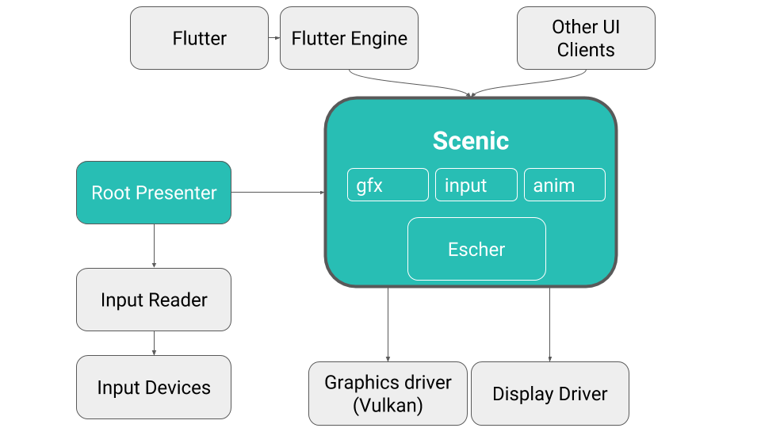
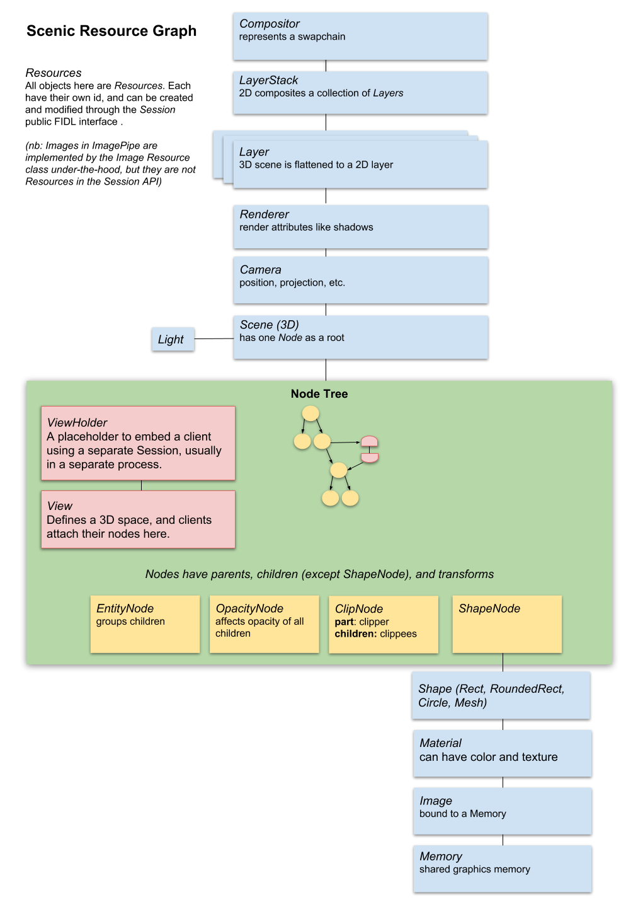
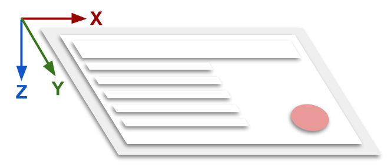
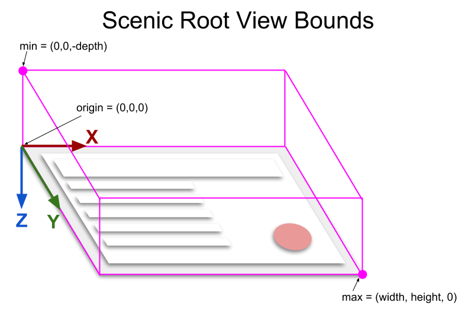

# Scenic, the Fuchsia graphics engine

* [Introduction](#introduction)
* [Scenic and Fuchsia](#scenic-and-fuchsia)
* [Concepts](#concepts)
  * [Scenic](#scenic)
  * [Sessions](#sessions)
  * [Resources](#resources)
    * [Nodes](#nodes)
    * [Scenes](#scenes)
    * [Compositors](#compositors)
  * [Coordinate Frames and Units](#coordinate-frames-and-units)
  * [Timing Model](#timing-model)
  * [Fences](#fences)
* [Examples of using Scenic](#examples-of-using-scenic)
* [API Guide](#api-guide)
  * [FIDL protocols](#fidl-protocols)

# Introduction

Scenic is a Garnet service that composes graphical objects from multiple
processes into a shared scene graph.  These objects are rendered within a
unified lighting environment (to a display or other render target); this
means that the objects can cast shadows or reflect light onto each other,
even if the originating processes have no knowledge of each other.

Scenic's responsibilities are:

- Composition: Scenic provides a retained-mode 3D scene graph that contains
  content that is independently generated and linked together by its
  clients.  Composition makes it possible to seamlessly intermix
  the graphical content of separately implemented UI components.

- Animation: Scenic re-evaluates any time-varying expressions within models
  prior to rendering each frame, thereby enabling animation of model
  properties without further intervention from clients.  Offloading
  animations to Scenic ensures smooth jank-free transitions.

- Rendering: Scenic renders its scene graph using Escher, a rendering
  library built on Vulkan, which applies realistic lighting and shadows to
  the entire scene.

- Scheduling: Scenic schedules scene updates and animations to anticipate
  and match the rendering target's presentation latency and refresh interval.

- Diagnostics: Scenic provides a diagnostic interface to help developers
  debug their models and measure performance.

## Scenic and Fuchsia

Scenic's API allows any client to insert its UI into the global scene graph.
Processes using the UI framework [_Flutter_](https://flutter.io/) are one
example; the lower layer of Flutter, called [_Flutter Engine_](https://github.com/flutter/engine),
contains code responsible for communicating with Scenic.

Scenic has several internal subsystems. _Gfx_ owns the scene graph and is
responsible for rendering. _Input_ is responsible for routing input events to clients,
which also involves coordinating gesture recognition across clients. _Anim_
is a yet-to-be created system for coordinating transitions across clients
as well as offloading animations to Scenic.

[_Escher_](/src/ui/lib/escher/README.md)
is a Vulkan-based rendering library used by the _Gfx_ system.

_Root Presenter_ is an independent service which is responsible for
_presenting_ the system's UI; using the Scenic API, it creates the root of a
Scenic scene graph, embeds the root process's UI, and reads input events
using its _Input Reader_ library and continually forwards them to Scenic.

Scenic is a client of the [_Vulkan graphics driver_](/garnet/lib/magma/)
and the system _Display Driver_.

# Concepts

## Scenic

The `Scenic` FIDL protocol is Scenic's front door.  Each instance of the
protocol represents a Scenic instance. Each Scenic instance is an isolated
rendering context with its own content, render targets, and scheduling loop.

The `Scenic` protocol allows a client to create a [`Session`](#session) which
is the communication channel used to publish graphical content to this instance.

A single Scenic instance can update, animate, and render multiple
`Scenes` (trees of graphical objects) to multiple targets in tandem on the same
scheduling loop.  This means that the timing model for a Scenic instance
is _coherent_: all of its associated content belongs to the same scheduling
domain and can be seamlessly intermixed.

In practice, there is one instance of Scenic and one Scene that is rendered to a
target. However, creating separate Scenic instances can be useful for rendering
to targets which have very different scheduling requirements or for running
tests in isolation. Independent Scenic instances cannot share content and are
therefore not coherent amongst themselves.

When a Scenic instance is destroyed, all of its sessions become
inoperable and its rendering ceases.

`Views` typically do not deal with the Scenic instance directly; instead
they receive a Scenic `Session` from the view manager.

## Sessions

The `Session` FIDL protocol is the primary API used by clients of Scenic to
contribute graphical content in the form of `Resources`.  Each session has
its own resource table and is unable to directly interact with resources
belonging to other sessions.

Each session provides the following operations:

- Submit operations to add, remove, or modify resources.
- Commit a sequence of operations to be presented atomically.
- Awaiting and signaling fences.
- Schedule subsequent frame updates.
- Form links with other sessions (by mutual agreement).

When a session is destroyed, all of its resources are released and all of
its links become inoperable.

`Views` typically receive separate sessions from the view manager.

## Resources

`Resources` represent scene elements such as nodes, shapes, materials, and
animations which belong to particular `Sessions`.

The list of Scenic resources is described by the API:
//sdk/fidl/fuchsia.ui.gfx/resources.fidl

Clients of Scenic generate graphical content to be rendered by queuing and
submitting operations to add, remove, or modify resources within their
session.

Each resource is identified within its session by a locally unique id which
is assigned by the owner of the session (by arbitrary means).  Sessions
cannot directly refer to resources which belong to other sessions (even if
they happen to know their id) therefore content embedding between sessions
is performed using `Link` objects as intermediaries.

To add a resource, perform the following steps:

- Enqueue an operation to add a resource of the desired type and assign it a
  locally unique id within the session.
- Enqueue one or more operations to set that resource's properties given its
  id.

Certain more complex resources may reference the ids of other resources
within their own definition.  For instance, a `Node` references its `Shape`
thus the `Shape` must be added before the `Node` so that the node may
reference it as part of its definition.

To modify a resource, enqueue one or more operations to set the desired
properties in the same manner used when the resource was added.

The remove a resource, enqueue an operation to remove the resource.

Removing a resource causes its id to become available for reuse.  However,
the session maintains a reference count for each resource which is
internally referenced.  The underlying storage will not be released (and
cannot be reused) until all remaining references to the resource have been
cleared *and* until the next frame which does not require the resource has
been presented.  This is especially important for `Memory` resources.
See also [Fences](#fences).

This process of addition, modification, and removal may be repeated
indefinitely to incrementally update resources within a session.

### Nodes

A `Node` resource represents a graphical object which can be assembled into
a hierarchy called a `node tree` for rendering.

[Here](scenic_resource_lifecycle.md) is a walk-through on how Scenic internally manages
the lifecycle of Node-like resources and embedded Views.

TODO: Discuss this in more detail, especially hierarchical modeling concepts
such as per-node transforms, groups, adding and removing children, etc.

### Scenes

A `Scene` resource combines a tree of nodes with the scene-wide parameters
needed to render it.  A Scenic instance may contain multiple scenes but
each scene must have its own independent tree of nodes.

A scene resource has the following properties:

- The scene's root node.
- The scene's global parameters such as its lighting model.

In order to render a scene, a `Camera` must be pointed at it.

### Compositors

Compositors are resources that come in two flavors: `DisplayCompositor` and
`ImagePipeCompositor`; their job is to draw the content of a `LayerStack`
into their render target.  For `DisplayCompositor`, the target display may
have multiple hardware overlays; in this case the compositor may choose
associate each of these with a separate layer, rather than flattening the
layers into a single image.

A `LayerStack` resource consists of an ordered list of `Layers`.  Each layer
can contain either an `Image` (perhaps transformed by a matrix), or a
`Camera` that points at a `Scene` to be rendered (as described above).

### Scenic Resource Graph

### TODO: More Resources

Add sections to discuss all other kinds of resources: shapes, materials,
links, memory, images, buffers, animations, variables, renderers etc.

## Coordinate Frames and Units
Scenic manages a global scene graph in a three dimensional space. Some of the charactaristics of
this space are defined by Scenic itself, whereas some are defined by the root presenter or even
other clients.

### Units
Units are configured by the root presenter. The default root presenter uses a device-independent
scalable unit called "pips" for the root space. See [Units and Metrics](units_and_metrics.md) for
details. What units are used for your view space depends on what transforms are applied to your
view by your parent.

### World Space
The Scenic world space is a right handed Cartesian space. It is configured by the root presenter
which configures the view and projection parameters of the camera. The default root presenter
will put the origin at the top left of the screen and make +X point right, +Y point down, and
+Z point into the screen.

### View Space
Ultimately the space of a given view depends on what transforms are applied to it by its parent
View and the parent View's parent and so on. If no rotation transform is applied and all scale
transforms are positive along all axes then the View's axes will align with the axes of the root
presenter and the handedness will match.

The bounds of the root view are defined by a min and a max point as follows:

## Timing Model

TODO(SCN-1202): Talk about scheduling frames, presentation timestamps, etc.

## Fences

TODO(SCN-1228): Talk about synchronization.

# Examples of using Scenic

A simple example of using Scenic is the [bouncing ball](/garnet/examples/ui/bouncing_ball/README.md) app.

# API Guide

## FIDL protocols

The following files define and document the collection of FIDL protocols that
make up Scenic.

* [Scenic top-level protocols](/sdk/fidl/fuchsia.ui.scenic) (`fuchsia.ui.scenic`)
  * [scenic.fidl](/sdk/fidl/fuchsia.ui.scenic/scenic.fidl)
  * [session.fidl](/sdk/fidl/fuchsia.ui.scenic/session.fidl)
  * [commands.fidl](/sdk/fidl/fuchsia.ui.scenic/commands.fidl)
  * [events.fidl](/sdk/fidl/fuchsia.ui.scenic/events.fidl)

* [Gfx](/sdk/fidl/fuchsia.ui.gfx) (`fuchsia.ui.gfx`)
  * [commands.fidl](/sdk/fidl/fuchsia.ui.gfx/commands.fidl)
  * [events.fidl](/sdk/fidl/fuchsia.ui.gfx/events.fidl)
  * [resources.fidl](/sdk/fidl/fuchsia.ui.gfx/resources.fidl)
  * [nodes.fidl](/sdk/fidl/fuchsia.ui.gfx/nodes.fidl)
  * [shapes.fidl](/sdk/fidl/fuchsia.ui.gfx/shapes.fidl)
  * [...](/sdk/fidl/fuchsia.ui.gfx)

* [Views](/sdk/fidl/fuchsia.ui.views) (`fuchsia.ui.views`)
  * [commands.fidl](/sdk/fidl/fuchsia.ui.views/commands.fidl)

* [Input](/sdk/fidl/fuchsia.ui.input) (`fuchsia.ui.input`)
  * [commands.fidl](/sdk/fidl/fuchsia.ui.input/commands.fidl)
  * [input_events.fidl](/sdk/fidl/fuchsia.ui.input/input_events.fidl)

* [Policy](/sdk/fidl/fuchsia.ui.policy) (`fuchsia.ui.policy`)
  * [presenter.fidl](/sdk/fidl/fuchsia.ui.policy/presenter.fidl)
  * [presentation.fidl](/sdk/fidl/fuchsia.ui.policy/presentation.fidl)
  * [...](/sdk/fidl/fuchsia.ui.policy)

* [App](/sdk/fidl/fuchsia.ui.app) (`fuchsia.ui.app`)
  * [view_provider.fidl](/sdk/fidl/fuchsia.ui.app/view_provider.fidl)

* [experimental] [Sketchy](/sdk/fidl/fuchsia.ui.sketchy) (`fuchsia.ui.sketchy`)
* [experimental] [Vectorial](/sdk/fidl/fuchsia.ui.vectorial) (`fuchsia.ui.vectorial`)

## TODO

Talk about how to get started using Scenic, running examples,
recommended implementation strategies, etc.
