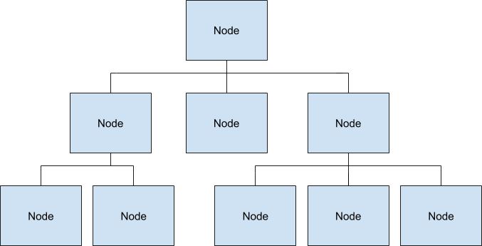
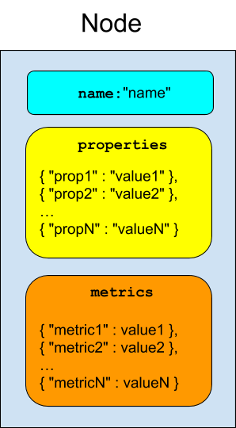

Fuchsia Component Inspection
=====

Components in Fuchsia may expose structured information about themselves
conforming to the Inspect API. This document describes the concepts of
Component Inspection, the interface, the C++ language implementation
of the interface, and user-facing tools for interacting with components
that expose information.

[TOC]

# Quick Links

* [iquery](iquery.md) &mdash; The userspace tool for inspecting components.
* [Getting started with Inspect](gsw-inspect.md) &mdash; A quick start guide.
* [VMO format](vmo-format/README.md) &mdash; Describes the Inspect VMO File Format.

# Concepts

Components may expose a tree of **Nodes** (formerly Objects), each of which has a set of
string-valued **Properties** and numeric **Metrics**.

## Node

A node is an exported entity within a component that may have 0 or
more children. Each node has a name, and each child of a node
must have a unique name among the children.

## Property

Nodes may have any number of properties. A property has a key and a
value which are both strings.

## Metric

Nodes may have any number of metrics. A metric has a string key and numeric value.

There are three types of metric values:

- `UINT`, a 64-bit unsigned integer.
- `INT`, a 64-bit signed integer.
- `DOUBLE`, a 64-bit floating point value.

## Events

**WORK IN PROGRESS**: Streaming events are planned to be supported in
the future.

# API

## Filesystem Interface

Components by default obtain a reference to their `out/` directory in
their hub.

*Top-level* nodes are exposed as VmoFiles in the Hub ending in the extension `.inspect`.
It is customary for components to expose their primary or root tree as
`out/objects/root.inspect`.

For the deprecated FIDL interface, a component exposes its root tree as a
`fuchsia.inspect.Inspect` service file at `out/objects`. Both FIDL and VMO
reading are currently supported by the `iquery` tool.

The manager for a component's environment may expose its own information
about the component to the hub. For instance, appmgr exposes
`system_objects` for each component.

# [C++ Interface](/garnet/public/lib/inspect/inspect.h)

Class `Inspector` is the main entrypoint into using the Inspect API.
Method `CreateTree` returns a new `Tree` object that wraps a VMO.

Each `Tree` has a root `Node` that can be obtained with `GetRoot`.

New children can be created underneath the root node, and each node may
contain any number of metrics and properties. Creation methods return
an RAII wrapper around the value. This wrapper owns the value stored in
the VMO, and it automatically removes the wrapped value when deleted.

## FIDL Compatibility Mode

The C++ interface supports wrapping the deprecated FIDL interface using
a compatibility mode.

Instead of using `CreateTree` and `Inspector`, you may instead construct
a node directly with a name to retrieve an exposable node using FIDL.

# Deprecated C++ Interface

This interface supports exposing nodes using the fuchsia.inspect.Inspect
FIDL interface. The main feature this supports over the VMO solution is
dynamic children and values, though these features are planned for VMO.

> Since this interface is deprecated, you will see the term "object"
> instead of "node".

## [Object Wrapper](/garnet/public/lib/inspect/deprecated/expose.h)

Class `Object` is the implementation of a node in C++. It implements
the `Vnode` and `Inspect` interfaces to expose the node through the
filesystem and raw FIDL protocols respectively.

Helper classes `Property` and `Metric` wrap the functionality of dealing
with their respective values and serializing to FIDL.

### On-Demand Values

Property values, metric values, and even the set of children may be set
on-demand through callbacks.

Properties and metrics utilizing a callback will *only* get their value
by callback until they are set to an explicit value.

The set of children for a node is the union of its explicitly set
children and on-demand children provided by callback.

### Arithmetic

`Metric` allows for typed addition and subtraction. The `Set*` methods set
the type of the metric, and arithmetic operations do not modify this type.

## [ObjectDir](/garnet/public/lib/inspect/deprecated/object_dir.h)

Class `ObjectDir` is a lightweight wrapper around a refcounted pointer
to an `Object`. `ObjectDirs` are safe to copy, and provide a stable
reference to a single node.

`ObjectDir` simplifies traversing a tree of nodes by name and setting
properties/metrics on those nodes with an STL-style wrapper.

## [ExposedObject](/garnet/public/lib/inspect/deprecated/exposed_object.h)

Class `ExposedObject` is a base class simplifying management of complex
persistent hierarchies of nodes. It is the recommended implementation
point for exposing nodes from your components.

An `ExposedObject` is not a node itself, rather it contains a reference
to the node itself as well as a reference to the (optional) parent for
the node. On destruction, the `ExposedObject` automatically removes
itself from its parent without invalidating underlying references to
the node. This enables developers to expose complex, rapidly changing
hierarchies of nodes without worrying about node lifetime.

# Userspace Tools

The primary userspace tool is [iquery](iquery.md), which has its own manual page.
